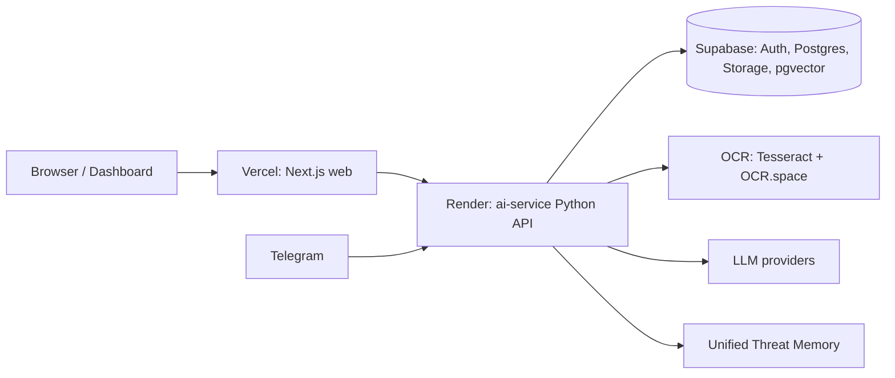
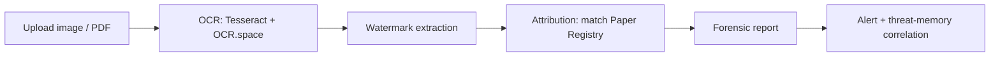
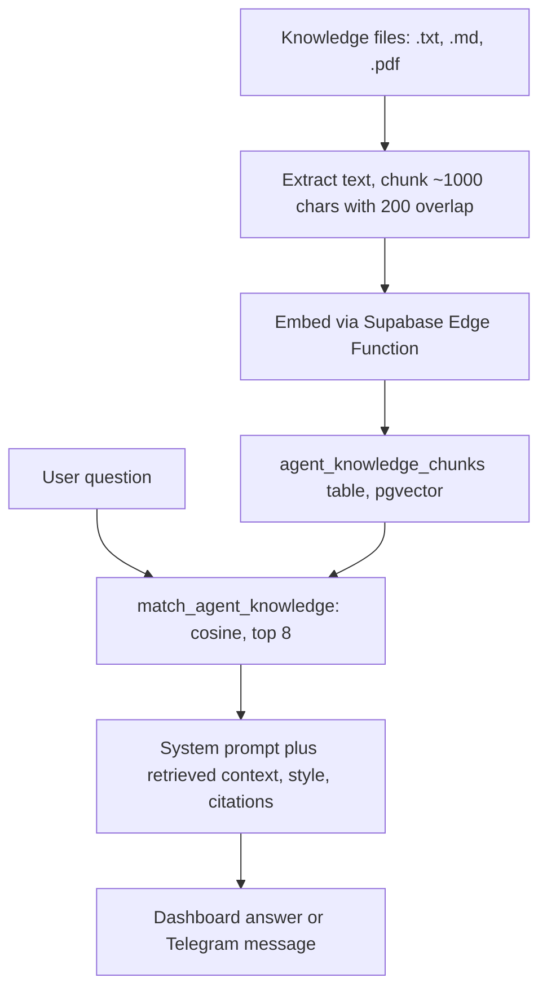

# EXAMSHIELD

[](https://github.com/risuhfoundry/Faraway-examshield/actions)
[](LICENSE)
[](https://faraway-examshield.vercel.app)
[](https://nextjs.org)
[](https://supabase.io)
[](https://python.org)

AI-assisted exam-leak detection and forensic watermark tracing for academic-integrity teams.

---

## Table of Contents

- [Why This Exists](#why-this-exists)
- [What It Does](#what-it-does)
- [Features](#features)
- [Architecture](#architecture)
- [The Evidence Pipeline](#the-evidence-pipeline)
- [Community Agents](#community-agents)
- [The AI Assistant](#the-ai-assistant)
- [Security and AI Safety](#security-and-ai-safety)
- [Tech Stack](#tech-stack)
- [Repository Layout](#repository-layout)
- [Getting Started](#getting-started)
- [Environment Variables](#environment-variables)
- [Testing & CI](#testing--ci)
- [Deployment](#deployment)
- [Contributing](#contributing)
- [License](#license)

---

## Why This Exists

Every examination season, somewhere a question paper leaks before the exam begins. Sometimes it is a photograph passed across a hostel corridor; sometimes it is a scanned PDF circulating in a Telegram group hours before the bell rings. By the time the leak is noticed, the paper is already compromised and the damage — to fairness, to trust, to the thousands of students who prepared honestly — is done.

EXAMSHIELD was built for the people who have to catch those leaks: investigation officers, center administrators, and forensic analysts. The core idea is simple to state and hard to do well — **find the leaked paper, trace it back to the center and print batch it came from, and give investigators a defensible chain of evidence before the exam is over.**

This is not a dashboard that shows you what already happened. It is a working system that ingests a suspicious image or document, reads it, identifies the watermark stamped into it, matches that watermark to a registry of every paper that was ever printed, and tells you — with a confidence score — which center and which batch betrayed the exam. Then it remembers, so that the next signal in another city can be correlated against the first.

## What It Does

EXAMSHIELD detects leaked question papers, traces watermarked sources through a forensic chain of custody, and alerts investigators — combining OCR, a paper registry, AI-assisted analysis, community agents, and multi-channel (Telegram) ingestion in one full-stack application.

A single Python backend (`apps/ai-service`) owns the entire analytical core: OCR, analysis jobs, attribution, forensic reports, alerts, the AI assistant, community agents, and optional Telegram ingestion. A Next.js frontend (`web`) is what investigators actually touch — the map, the chat, the evidence feed. Supabase sits underneath as the system of record: authentication, the Postgres database, file storage, and pgvector-backed semantic memory.

## Features

- **Evidence pipeline** — upload → OCR (Tesseract + OCR.space) → watermark extraction → paper attribution → forensic report → alerts. One continuous, auditable flow from a raw image to a courtroom-ready conclusion.
- **Question Paper Registry** (`apps/core`) — chain-of-custody records (watermark, paper, exam, center, print batch, risk, status) used to match leaked papers to their source.
- **Community Agents** — per-agent system prompts, knowledge, and RAG (Supabase pgvector with a local fallback); agents reply with citations and can run as their own Telegram bots. See [Community Agents](#community-agents).
- **Unified threat memory** — privacy-first, cross-case correlation of leaked-paper signals (Supabase pgvector, local JSON fallback). The system gets smarter across cases rather than forgetting each one.
- **AI assistant** — streaming chat (Kilo Gateway by default; OpenAI / Anthropic / Grok / Groq / OpenCode Zen supported) with schema-driven tool routing. See [The AI Assistant](#the-ai-assistant).
- **Multi-channel ingestion** — dashboard uploads and a Telegram webhook feed the same pipeline, so a leak reported in a group chat and a leak uploaded by an officer are treated identically.
- **Security & AI safety** — Supenbase JWT auth (email/password, Google & GitHub OAuth), Next.js middleware route protection, agent LLM keys encrypted at rest (Fernet), prompt-injection and rate-limit guards, and a grounding/hallucination check. See [Security and AI Safety](#security-and-ai-safety).

## Architecture



The frontend never talks to the backend directly. Every request — chat, evidence, agents, analysis — is routed through Next.js proxy routes (`web/src/app/**/route.ts`) that read `EXAMSHIELD_API_URL` server-side and forward the call, attaching a shared secret. This keeps API keys and the backend address out of the browser bundle and lets the same backend serve both the Vercel deployment and a local dev machine. In production the backend runs on Render (Dockerized), the frontend on Vercel, and the data layer on Supabase.

### Repository Layout

```
examshield/
├── web/                 # Next.js 16 frontend (Vercel)
├── apps/
│   ├── ai-service/      # Unified Python API: OCR, analysis, AI, agents, Telegram
│   ├── core/            # TypeScript Paper Registry (chain of custody)
│   ├── vision/          # Python YOLO / Supervision / OpenCV detection stack
│   ├── api/             # placeholder
│   └── broadcast-agent/ # placeholder
├── supabase/            # SQL schema
├── docs/                # Deployment, tech-stack, roadmap, audits
├── Dockerfile           # Python 3.12 + Tesseract
├── render.yaml          # Render backend service
└── vercel.json          # Vercel frontend config
```

## The Evidence Pipeline



A piece of evidence enters the system as an uploaded image or PDF. It is OCR'd using an engine chain (`ocrspace,tesseract` by default), which means the cheaper, faster engine runs first and the slower, more careful engine fills the gaps. Watermarks are extracted from the recognized text — the faint, often-overlooked identifiers that tie a sheet to a specific print run. Those watermarks are attributed against the Question Paper Registry, producing a forensic report with a confidence score and an identified paper. Any match, and any novel signal that does not yet match, is correlated in the unified threat memory, which can in turn raise memory alerts when a pattern emerges across centers.

## Community Agents

Community Agents are configurable assistants that answer in their own voice, grounded in their own knowledge, and (optionally) operate their own Telegram bots. Each agent is defined by:

- a **system prompt** and **response style** (`short` / `balanced` / `detailed`);
- a **citation mode** that asks the model to cite the knowledge it used;
- one or more **knowledge sources** (uploaded text / Markdown / PDF files);
- an **LLM config** (provider, model, and an API key that is **encrypted at rest**);
- an optional **Telegram config** (`botToken` + deployment status) that lets the agent reply in DMs.

### Knowledge & RAG



On ingest, files are extracted (PDFs via PyMuPDF, with a scanned-page OCR fallback), chunked, embedded through the Supabase embedding function, and stored in the `agent_knowledge_chunks` table (pgvector). At query time the question is embedded and matched with `match_agent_knowledge` (cosine similarity, top 8, threshold 0.7). When Supabase is unavailable the backend falls back to a local JSON chunk index.

### Per-agent Telegram bots

A background poller (`apps/ai-service/examshield_ai/agent_telegram.py`) long-polls `getUpdates` for every **deployed** agent that has its own `botToken` and replies **as that agent**, using the agent's own LLM provider and knowledge — the same code path as the dashboard *Test Agent* panel (`POST /agents/{id}/test`). Bots answer direct messages only (never groups) and clear any webhook so polling works. The global EXAMSHIELD bot is unaffected and keeps answering as EXAMSHIELD AI.

> **Note:** Telegram privacy mode must be **disabled** for a bot to read group messages. If you see `Bot privacy mode is ON` at startup, open @BotFather → `/setprivacy` → select the bot → Disable, then restart.

### Encryption at rest

Agent LLM keys are encrypted with Fernet (AES-128-CBC + HMAC-SHA256) before they are stored, using the master key from `EXAMSHIELD_AI_MASTER_KEY` (any passphrase is derived via SHA-256). The plaintext key is never returned to API clients. If the master key is unset, a built-in development key is used with a loud warning — fine for local dev, not for production. Generate a production key with:

```bash
python -c "from examshield_ai.secrets_crypto import generate_master_key; print(generate_master_key())"
```

## The AI Assistant

The in-app assistant (`POST /chat`, SSE token streaming) is backed by an LLM provider and uses **schema-driven tool routing**: a cheap, zero-LLM intent check decides whether to attach tool schemas, then tool calls are executed against live EXAMSHIELD data and the model answers from the result (bounded to a few iterations). When no model key is configured it falls back to a local operational message. Supported providers: **Kilo Gateway** (default `stepfun/step-3.7-flash:free`), **OpenAI**, **Anthropic**, **Grok**, **Groq**, and **OpenCode Zen**.

## Security and AI Safety

- **Auth** — Supabase JWT (email/password, Google & GitHub OAuth); Next.js middleware enforces route protection.
- **Prompt-injection guard** (`injection.py`) — external text (Telegram, OCR output, user input) is scanned for instruction-override, role-play, and exfiltration patterns, then wrapped in `<UNTRUSTED_TEXT>` delimiters with a hardening note. On by default (`EXAMSHIELD_INJECTION_DETECTION` / `EXAMSHIELD_INJECTION_SANITIZE`).
- **Grounding / hallucination check** (`hallucination.py`) — after generation, numeric claims in the answer are checked against the retrieved source; ungrounded figures surface a non-blocking warning (addresses audit §11.2).
- **Token budget** (`budget.py`) — per-origin daily LLM token allowance to protect provider quota; off unless `EXAMSHIELD_LLM_DAILY_TOKEN_BUDGET` is set.
- **Rate limiting** (`ratelimit.py`) — sliding-window limiter on `/ocr/analyze` and `/evidence/upload` (paid external calls); off unless `EXAMSHIELD_RATE_LIMIT_*` vars are set.
- **Encryption at rest** — agent LLM keys encrypted with Fernet (see [Community Agents](#community-agents)).
- **Unified threat memory** (`memory.py`) — privacy-first: emails, phones, URLs, and IDs are redacted before storage; signals are embedded (pgvector) and correlated by similarity plus fingerprint, raising memory alerts on multi-source matches. Falls back to local JSON when Supabase is unavailable.
- **Backend API authentication** — every non-health backend call is gated by a shared secret (`EXAMSHIELD_API_AUTH_SECRET`); the frontend proxy forwards it as `X-Examshield-Api-Key`. When the secret is unset the gate is disabled (with a startup warning), which is acceptable for local offline development but never for production.

## Tech Stack

| Area | Stack |
|------|-------|
| Frontend | Next.js 16 · React 19 · TypeScript · Tailwind CSS 4 · Supabase SSR |
| Backend | Python 3.12 · Tesseract + OCR.space · Supabase (Auth / Postgres / Storage / pgvector) · LLM via Kilo Gateway / OpenAI / Anthropic / Grok / Groq / OpenCode Zen · Telegram Bot API |
| Infra | Supabase · Render (Docker) · Vercel · GitHub Actions |

## Repository Layout

(See [Architecture](#architecture) above for the tree and the request flow.)

## Getting Started

**Prerequisites:** Node.js 20, Python 3.12, and a Supabase project (optional — the backend falls back to local files for offline development).

### Frontend

```bash
cd web
npm install --legacy-peer-deps

# Create web/.env.local:
#   NEXT_PUBLIC_SUPABASE_URL=https://your-project.supabase.co
#   NEXT_PUBLIC_SUPABASE_ANON_KEY=your-anon-key
#   EXAMSHIELD_API_URL=http://127.0.0.1:8790
#   EXAMSHIELD_BACKEND_API_KEY=...   # must match backend EXAMSHIELD_API_AUTH_SECRET

npm run dev
```

> The frontend and backend run on **different ports by design** (the frontend is Next.js, typically 3000; the backend is the Python service, default 8790 — overridable via `PORT`/`EXAMSHIELD_AI_PORT`). They are not meant to share a port. The frontend reaches the backend exclusively through its server-side proxy routes, which is why `EXAMSHIELD_API_URL` must point at the backend's address.

### Backend

```bash
cd apps/ai-service
python -m venv .venv && source .venv/bin/activate   # Windows: .venv\Scripts\activate
pip install -r requirements.txt

# Set environment (see apps/ai-service/.env), then:
python service.py   # http://127.0.0.1:8790
```

### Environment variables

| Variable | Required | Purpose |
|----------|----------|---------|
| `SUPABASE_URL` | yes* | Supabase project URL |
| `SUPABASE_SERVICE_ROLE_KEY` | yes* | Supabase service-role key |
| `KILO_API_KEY` | yes* | Kilo Gateway API key (AI chat) |
| `EXAMSHIELD_AI_CORS_ORIGIN` | yes* | Frontend URL allowed by CORS |
| `EXAMSHIELD_API_AUTH_SECRET` | yes*† | Shared secret protecting the backend API (audit §2.2); the frontend proxy sends it as `X-Examshield-Api-Key` |
| `EXAMSHIELD_PUBLIC_URL` | no | Public backend URL (Telegram webhook) |
| `TELEGRAM_BOT_TOKEN` | no | Telegram bot token |
| `TELEGRAM_WEBHOOK_SECRET` | no | Telegram webhook secret |
| `EXAMSHIELD_AI_MASTER_KEY` | no† | Fernet master key; encrypts agent LLM keys at rest |
| `EXAMSHIELD_AI_MODEL` | no | Chat model (default `stepfun/step-3.7-flash:free`) |
| `OCR_SPACE_API_KEY` | no | Enables the OCR.space engine |

\* Required for production (Supabase-backed) deployments; without them the backend runs in offline mode.
† Required only when storing agent LLM keys. Generate with `python -c "from examshield_ai.secrets_crypto import generate_master_key; print(generate_master_key())"`.
‡ Required for production to authenticate the backend API (audit §2.2). When unset the API is reachable anonymously with a startup warning. The frontend must set `EXAMSHIELD_BACKEND_API_KEY` to the same value.

The full variable list (OCR chain, timeouts, planner models, rate limits, token budget, etc.) is in [`render.yaml`](render.yaml). See [`docs/DEPLOYMENT.md`](docs/DEPLOYMENT.md) for setup details.

## Testing & CI

```bash
# Frontend
cd web && npm run lint && npm run build

# Core (Paper Registry)
cd apps/core && npm test

# Backend (unified API)
cd apps/ai-service && ruff check . && pytest -q
```

CI runs on GitHub Actions (`.github/workflows/ci.yml`): backend lint + tests and frontend lint + build on every push/PR to `main`.

## Deployment

EXAMSHIELD runs as one Python backend on Render (Docker) and a Next.js frontend on Vercel, with Supabase for auth, database, storage, and pgvector. For the full walkthrough (Supabase schema, Render blueprint, Vercel env, Telegram webhook), see [`docs/DEPLOYMENT.md`](docs/DEPLOYMENT.md).

## Contributing

1. Fork the repository and create a feature branch.
2. Make your change with conventional commits.
3. Ensure lint and tests pass.
4. Open a pull request against `main`.

## License

[MIT](LICENSE) — Copyright © 2026 Rishab.
