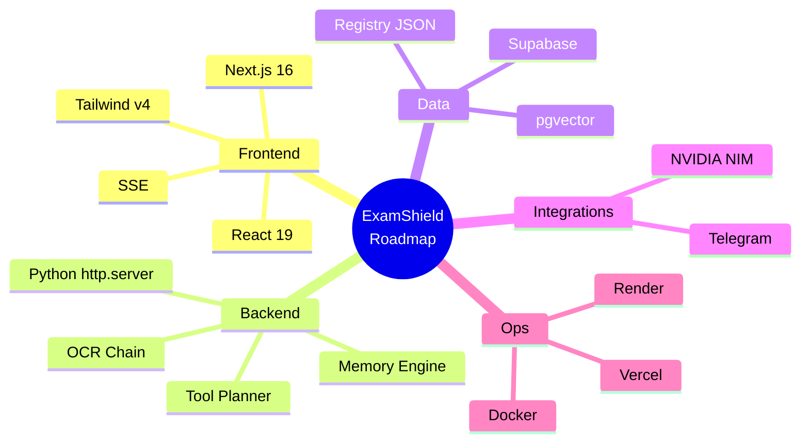
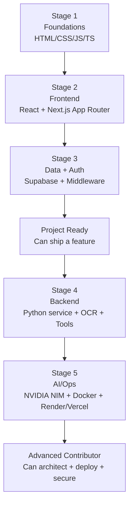
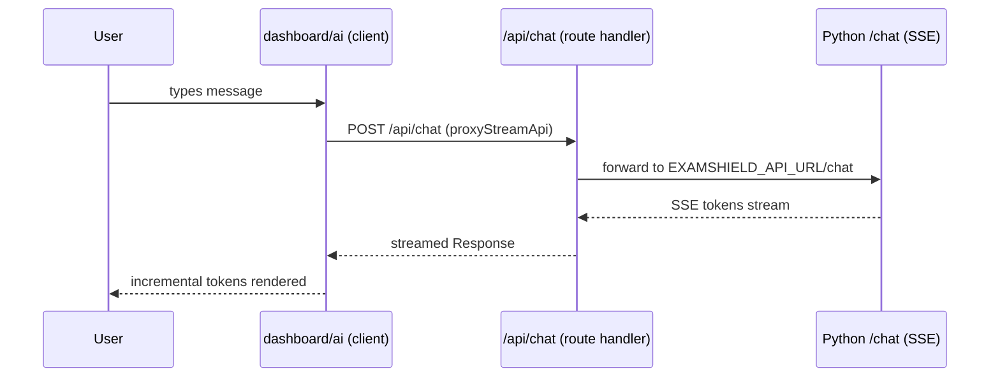
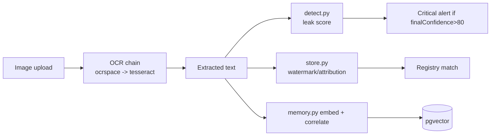

# Faraway ExamShield

## Complete Learning Roadmap

### Technologies, Skills & Knowledge Required

> **Who this is for:** Any developer (junior or senior) who wants to become productive on the Faraway ExamShield repository.
> **What this is NOT:** A marketing one-pager or a simple "tech stack" list. This is a *curriculum* — a self-study guide that maps every technology, framework, library, pattern, and engineering skill back to a concrete file in this repository.
> **Evidence policy:** Every claim below is grounded in actual repository files (path references are given inline). Where a capability is *inferred* from documentation rather than proven by code, it is explicitly tagged **(Recommended for deeper understanding)**.

---

## Table of Contents

1. [Introduction](#1-introduction)
2. [Overall Learning Path](#2-overall-learning-path)
3. [Required Programming Languages](#3-required-programming-languages)
4. [Frontend Skills](#4-frontend-skills)
5. [Backend Skills](#5-backend-skills)
6. [Database Skills](#6-database-skills)
7. [Authentication Skills](#7-authentication-skills)
8. [AI & OCR Skills](#8-ai--ocr-skills)
9. [DevOps Skills](#9-devops-skills)
10. [Security Skills](#10-security-skills)
11. [Architecture Skills](#11-architecture-skills)
12. [Repository-Specific Knowledge](#12-repository-specific-knowledge)
13. [Library-by-Library Guide](#13-library-by-library-guide)
14. [Concepts to Master](#14-concepts-to-master)
15. [Suggested Learning Order](#15-suggested-learning-order)
16. [Estimated Learning Time](#16-estimated-learning-time)
17. [Recommended Resources](#17-recommended-resources)
18. [Hands-on Exercises](#18-hands-on-exercises)
19. [Common Mistakes](#19-common-mistakes)
20. [Interview Questions](#20-interview-questions)
21. [Contribution Checklist](#21-contribution-checklist)
22. [Personal Learning Plan](#22-personal-learning-plan)
23. [Mastery Checklist](#23-mastery-checklist)
24. [Final Summary](#24-final-summary)

---

## 1. Introduction

### 1.1 Purpose of this roadmap

Faraway ExamShield is a multi-service, AI-assisted anti-cheating / exam-leak monitoring platform. A new engineer joining the project is immediately confronted with:

- a **Next.js 16 + React 19** frontend (`web/`) written in strict TypeScript,
- a **hand-built Python 3.12 HTTP backend** (`apps/ai-service/`) that uses Tesseract + OCR.space OCR, NVIDIA NIM LLMs, a tool-calling planner, a memory/correlation engine, and a Telegram webhook listener,
- a **TypeScript CLI data layer** (`apps/core/`) for the "Paper Registry",
- a separate **YOLO + Supervision computer-vision pipeline** (`apps/vision/`),
- a **Supabase** (PostgreSQL + pgvector + Storage + Auth) data tier (`supabase/`),
- and **two deployment targets**: Vercel (frontend) and Render (backend Docker image), coordinated by `render.yaml` and `vercel.json`.

No single tutorial teaches all of that. This document stitches the required knowledge into one ordered curriculum. It tells you *what* to learn, *why* it matters here, *where* in the repo it is used, *how hard* it is, and *what to practice*.

### 1.2 Who should use it

- **New hires / contributors** who need a week-one onboarding plan.
- **Frontend specialists** who must understand the backend proxy model, Supabase auth, and SSE streaming.
- **Backend / Python engineers** who must understand the stdlib HTTP server, OCR chain, tool planner, and pgvector storage.
- **DevOps / platform engineers** who deploy to Vercel + Render and manage secrets.
- **Tech leads** who need a contribution and review checklist.

### 1.3 Expected outcome

After working through this roadmap you should be able to:

- Run the full stack locally (`web`, `apps/ai-service`, Supabase).
- Add a dashboard page, an API proxy route, and a backend endpoint.
- Extend the OCR pipeline, the tool registry, or the memory engine.
- Deploy and debug the app on Vercel + Render.
- Review a pull request with confidence about security, architecture, and data integrity.



---

## 2. Overall Learning Path

The repository spans four distinct competence areas. The path below goes from "can read the code" to "can lead changes".



| Stage | Focus | Repo entry points | Exit criterion |
|-------|-------|-------------------|----------------|
| 1 — Foundations | Web fundamentals, TypeScript | `web/tsconfig.json`, `web/src/app/globals.css` | Can read TS/TSX without guessing |
| 2 — Frontend | React 19 + Next.js 16 App Router | `web/src/app/**`, `web/src/components/**` | Can add a dashboard page |
| 3 — Data & Auth | Supabase SSR, middleware, RLS | `web/src/middleware.ts`, `web/src/lib/supabase/*`, `supabase/schema.sql` | Can wire an authenticated query |
| 4 — Backend | Python stdlib service, OCR, tools | `apps/ai-service/examshield_ai/server.py`, `ocr.py`, `tools.py` | Can add a backend route |
| 5 — AI & Ops | NVIDIA NIM, Docker, Render, Vercel | `llm.py`, `Dockerfile`, `render.yaml`, `vercel.json` | Can deploy + debug in prod |

> **Note:** Stages 1–3 can be done first if you are a frontend engineer; stages 4–5 are required for backend work. The two tracks converge at "Project Ready".

---

## 3. Required Programming Languages

This project is genuinely polyglot. The table summarizes the languages and where each lives.

| Language | Where it is used | Why | Difficulty | Priority |
|----------|------------------|-----|-----------|----------|
| TypeScript | `web/`, `apps/core/`, `supabase/functions/embed/index.ts` | Type-safe UI + CLI + Edge Function | Medium | **Critical** |
| JavaScript | Browser runtime (emitted from TSX), some config | React components execute as JS | Low–Medium | High (implicit) |
| Python 3.12 | `apps/ai-service/`, `apps/vision/` | Backend service, OCR, CV, memory engine | Medium | **Critical** |
| SQL | `supabase/schema.sql` (PostgreSQL + pgvector) | Schema, RLS, vector search functions | Medium | High |

### 3.1 TypeScript

**Why it is used:** The frontend (`web/`) and the CLI data layer (`apps/core/`) are written in TypeScript so that domain types (evidence records, forensic reports, agents) are checked at compile time. See `web/tsconfig.json` (`"strict": true`, `paths: { "@/*": ["./src/*"] }`) and `apps/core/lib/schema.ts` for the `PaperRecord` types.

**Where it is used:**
- `web/src/**/*.tsx` and `*.ts` — pages, components, lib helpers.
- `web/src/lib/evidence-types.ts`, `agent-types.ts` — shared domain types.
- `apps/core/lib/*.ts` — pure query/seed functions.
- `supabase/functions/embed/index.ts` — Deno Edge Function (TypeScript).

**Syntax & concepts required:**
- `type` vs `interface`, generics, union types, `as const`, discriminated unions.
- `async/await`, `Promise`, `fetch` (used heavily in `web/src/lib/api-proxy.ts`).
- ES modules, `import type`, path aliases (`@/`).
- React-specific: `.tsx`, JSX, hooks.
- Strict-null checking (`strict: true`) — you must handle `null`/`undefined`.

```typescript
// Example from web/src/lib/evidence-types.ts (shape, not verbatim)
export type EvidenceRecord = {
  id: string;
  source: "upload" | "telegram" | "manual";
  status: "pending" | "analyzed" | "critical";
  finalConfidence: number;
  detectedCategories: string[];
  createdAt: string;
};
```

**Difficulty:** Medium (easy if you know JS; the `strict` mode is the main hurdle).
**Priority:** Critical — you cannot change a single frontend file without it.
**Recommended proficiency:** Comfortable reading advanced types, writing generic functions, and reasoning about `Promise` pipelines.

### 3.2 JavaScript (browser runtime)

**Why it is used:** TypeScript compiles to JavaScript; React 19 components run as JS in the browser. You rarely write `.js` by hand here, but you must understand what the browser actually executes (closures, event loop, `fetch`, the streaming `ReadableStream` used for SSE in `web/src/app/dashboard/ai/page.tsx`).

**Where it is used:** Every `.tsx` file is, after build, JavaScript. `web/src/lib/api-proxy.ts` uses the Web `fetch` + `AbortController` + `ReadableStream` APIs.

**Important concepts:** Event loop, microtasks, `AbortController` (see `getTimeoutMs`/`sleep` retry logic in `api-proxy.ts`), `ReadableStream`/`TextDecoder` for SSE, `FormData`/`Blob` for uploads.

**Difficulty:** Low–Medium. **Priority:** High (implicit — you know it through TS).

### 3.3 Python 3.12

**Why it is used:** The AI service (`apps/ai-service/`) and the vision pipeline (`apps/vision/`) are Python because of the ML/OCR ecosystem (Tesseract subprocess, OpenCV, Ultralytics, pgvector, NVIDIA SDKs). Note the backend deliberately avoids Flask/FastAPI — it is a **hand-rolled `http.server`** (`ThreadingHTTPServer`) in `apps/ai-service/examshield_ai/server.py`. This is unusual and is a key learning point (see §5, §11).

**Where it is used:**
- `apps/ai-service/service.py` → `examshield_ai/server.py` (`main()`).
- `ocr.py`, `ocrspace.py`, `detect.py`, `tools.py`, `planner.py`, `memory.py`, `telegram.py`, `store.py`, `pipeline.py`, `workers.py`, `llm.py`, `rag.py`.
- `apps/vision/scripts/*.py`.

**Syntax & concepts required:**
- `dataclasses` (`settings.py` uses a frozen `Settings` dataclass).
- `from __future__ import annotations` (present at top of modules for forward refs).
- `subprocess` (Tesseract invocation in `ocr.py`).
- `concurrent.futures.ThreadPoolExecutor` (`workers.py`).
- `http.server.BaseHTTPRequestHandler` + `ThreadingHTTPServer` (`server.py`).
- `urllib.request` (NVIDIA calls in `llm.py` — note: *not* `requests`; `requests` is not in `requirements.txt`).
- Type hints + `typing` (`JsonObject`, `Path`, `tuple[str, ...]`).
- Context managers, generators, `asyncio` is **not** used (the server is threaded, not async).

```python
# apps/ai-service/examshield_ai/settings.py (shape)
@dataclass(frozen=True)
class Settings:
    host: str
    port: int
    model: str
    fallback_models: tuple[str, ...]
    ...

def load_settings() -> Settings:
    ...
```

**Difficulty:** Medium. **Priority:** Critical for backend work. **Recommended proficiency:** Comfortable with stdlib HTTP servers, subprocess, threading, and type hints.

> **Tip:** Because there is no web framework, you must understand how `do_GET`/`do_POST` dispatch works in `server.py` (it manually parses `self.path`, reads `Content-Length`, and calls `_send_json`). Read lines ~65–320 of `server.py` first.

### 3.4 SQL (PostgreSQL + pgvector)

**Why it is used:** Supabase is Postgres. The schema lives in `supabase/schema.sql`. It defines document storage, memory items with `vector(384)` embeddings, community-agent tables, and SQL functions for cosine similarity search (`match_examshield_memory`, `match_agent_knowledge`).

**Where it is used:**
- `supabase/schema.sql` — all DDL, RLS enablement, indexes, SQL functions.
- Called via Supabase REST from `store.py` (`/rest/v1/{table}`) and via the `embed` Edge Function.

**Syntax & concepts required:**
- `CREATE TABLE`, `PRIMARY KEY`, `UNIQUE`, `REFERENCES ... ON DELETE CASCADE`.
- `jsonb` columns (`examshield_documents.payload`).
- Extensions: `vector` (pgvector), `pgcrypto` (`gen_random_uuid()`).
- Indexes: `hnsw (embedding vector_cosine_ops)` for vector search.
- Functions: `language sql stable`, cosine distance operator `<=>`, `1 - (a <=> b)` similarity.
- RLS: `enable row level security` (policies are *not* defined in this repo because the backend uses the service-role key — see §6/§10).

```sql
-- supabase/schema.sql (verbatim excerpt)
create index if not exists examshield_memory_items_embedding_hnsw
  on public.examshield_memory_items
  using hnsw (embedding vector_cosine_ops)
  where embedding is not null;

-- cosine similarity search
1 - (item.embedding <=> query_embedding) as similarity
```

**Difficulty:** Medium. **Priority:** High. **Recommended proficiency:** Can write joins, design indexes, and read/modify the schema and vector functions.

---

## 4. Frontend Skills

The frontend is a Next.js 16 App Router app with React 19, Tailwind CSS v4, Framer Motion, Recharts, and react-simple-maps. All file references are under `web/`.

### 4.1 React 19

**Where:** `web/src/app/**`, `web/src/components/**`.

**Key concepts to learn:**
- **JSX / TSX** — `web/src/app/dashboard/ai/page.tsx` is a 26 KB component; JSX is how UI is described.
- **Components & Props** — presentational components in `web/src/components/sections/Hero.tsx`, `ThreatMap.tsx`.
- **State** — `useState` for local UI; `useReducer` for complex flows.
- **Hooks** — `useEffect`, `useCallback`, `useMemo`, `useRef`. See `web/src/lib/use-evidence-feed.ts` (a custom polling hook with localStorage + in-memory cache, 3–5 s interval).
- **Context** — used for auth/session in `web/src/app/dashboard/layout.tsx` (Supabase auth state listener).
- **Effects & cleanup** — interval teardown in `use-evidence-feed.ts`.
- **Memoization** — `useMemo` to avoid re-rendering charts; `React.memo` for heavy components like `ThreatMap.tsx`.
- **Performance** — `dashboard/ai/page.tsx` streams tokens; avoid re-render storms by isolating the SSE reader.

> **React 19 note:** React 19 uses the new JSX transform, ref as a prop, and improved hydration. The project pins `react`/`react-dom` `19.2.4` (see `web/package.json`).

### 4.2 Next.js 16 (App Router)

**Where:** `web/src/app/`.

| Concept | Repo evidence | What to learn |
|---------|---------------|---------------|
| App Router | `web/src/app/dashboard/...`, `web/src/app/api/...` | File-based routing under `app/` |
| Server vs Client Components | `"use client"` in `dashboard/layout.tsx`, `ai/page.tsx` | When to use server vs client |
| Routing & Layouts | `web/src/app/dashboard/layout.tsx` (sidebar + 10 `NAV_ITEMS`) | Nested layouts, shared UI |
| Middleware | `web/src/middleware.ts` + `web/src/lib/supabase/middleware.ts` | Edge/Node route protection |
| Metadata | `web/src/app/layout.tsx` | SEO/meta tags |
| API Routes (Route Handlers) | `web/src/app/api/**/route.ts` | `export async function GET/POST` |
| Server Actions | Not used (proxy pattern instead) | **(Recommended for deeper understanding)** |
| Caching | `runtime = "nodejs"` on routes; `cache: "no-store"` in `api-proxy.ts` | Opt-out of caching for live data |
| Streaming / RSC | SSE consumption in `dashboard/ai/page.tsx` | Server-to-client streams |

**Server vs Client components (critical):** The dashboard pages that read `localStorage`, attach event listeners, or drive animation are `"use client"`. The proxy routes (`api/**/route.ts`) run on the Node runtime (`export const runtime = "nodejs";`). Note that `web/src/middleware.ts` has a `matcher` that **excludes `/api/`** — API routes are *not* gated by middleware; they are thin proxies to the Python backend (see §5).

**App Router tree:**

```mermaid
flowchart LR
    Root[app/layout.tsx] --> Page[app/page.tsx<br/>Landing]
    Root --> Login[app/login]
    Root --> Signup[app/signup]
    Root --> Auth[app/auth/callback]
    Root --> Dash[app/dashboard/layout.tsx]
    Dash --> Cmd[Command Center]
    Dash --> AI[ai<br/>SSE chat]
    Dash --> Ev[evidence]
    Dash --> Reg[registry + upload + [paperId]]
    Dash --> Th[threats]
    Dash --> Inv[investigation]
    Dash --> Life[lifecycle]
    Dash --> Al[alerts]
    Dash --> CA[community-agents/*]
    Dash --> Set[settings]
```

### 4.3 Tailwind CSS v4

**Where:** `web/src/app/globals.css` (`@import "tailwindcss";` + `@theme { ... }`), `web/postcss.config.mjs` (`@tailwindcss/postcss`), `web/package.json` (`tailwindcss@^4`).

**What's different in v4 (vs v3):** No `tailwind.config.js` by default; theme tokens are declared in CSS via `@theme`. The repo defines custom color tokens (`--color-background: #000000`, `--color-card`, `--color-brand`, etc.) and font tokens (`--font-sans: var(--font-inter)`, `--font-heading: var(--font-oswald)`). Utility classes like `bg-card`, `text-muted-foreground`, `rounded-xl` come from these tokens.

**Concepts:** utility-first CSS, responsive prefixes (`sm:`, `md:`, `lg:`), dark mode (here it is always dark — pure black theme), custom theme variables, `@layer base`.

**Helper libs:** `clsx` (`web/package.json`) and `tailwind-merge` (`web/src/lib/utils.ts`) are used together to merge conditional class names safely:

```tsx
import { cn } from "@/lib/utils"; // clsx + tailwind-merge
<div className={cn("glass-panel", isActive && "border-white/25")} />
```

### 4.4 Responsive Design

The dashboard uses a fixed sidebar (`dashboard/layout.tsx`) plus responsive grids in pages like `dashboard/evidence/page.tsx` and `dashboard/registry/page.tsx`. Learn CSS Grid/Flexbox, Tailwind breakpoints, and container queries.

### 4.5 Animations

`framer-motion@^12.40.0` drives transitions and the threat map. See `web/src/components/sections/ThreatMap.tsx` (animated markers over an India SVG map from `@svg-maps/india`) and `web/src/components/effects/FloatingParticles.tsx`. Concepts: `motion.div`, `AnimatePresence`, variants, spring transitions.

### 4.6 Charts & Maps

- **Recharts** (`recharts@^3.8.1`) — used in dashboard analytics (e.g., `dashboard/lifecycle/page.tsx`, `community-agents/analytics/page.tsx`). Learn `<LineChart>`, `<BarChart>`, responsive containers.
- **react-simple-maps** (`^3.0.0`) + `@svg-maps/india` — choropleth-style maps. See `ThreatMap.tsx` and the coordinate lookup in `web/src/lib/map-centers.ts` (lat/lng → SVG projection) and `web/public/registry/centers.json`.

### 4.7 Forms & Validation

Auth forms live in `web/src/app/login/page.tsx` and `signup/page.tsx` (Supabase `signInWithPassword` / `signUp`). Upload forms in `dashboard/registry/upload/page.tsx` and `evidence/upload/route.ts`. Learn controlled inputs, `FormData`, client-side checks, and the backend validation in `store.py` (`validate_upload`).

### 4.8 Accessibility

ARIA roles on the sidebar/nav, alt text on icons (`lucide-react` icons are decorative), keyboard focus management in dialogs. **(Recommended for deeper understanding)** — formal a11y audits are not present in the repo.

### 4.9 Server-Sent Events (SSE) consumption

`web/src/app/dashboard/ai/page.tsx` consumes the streaming `/chat` endpoint through `proxyStreamApi`. Learn `fetch` + `response.body.getReader()` + `TextDecoder` + line-based SSE parsing. This is a core frontend skill unique to this repo.



---

## 5. Backend Skills

The backend is **not** Flask/FastAPI. It is a custom `http.server` server (`apps/ai-service/examshield_ai/server.py`, ~65 KB). Understanding this is the single most important backend insight.

### 5.1 Hand-rolled HTTP server (the big idea)

`service.py` calls `main()` from `server.py`. `ExamshieldAiHandler(BaseHTTPRequestHandler)` is served by `ThreadingHTTPServer`. In `do_GET`/`do_POST` the handler:

1. parses `urlparse(self.path).path`,
2. splits the path into `parts`,
3. matches exact paths (`/health`, `/evidence`, `/ocr/analyze`) and parameterized paths (`parts[0] == "evidence"`),
4. reads the body via `self.rfile.read(content_length)` or `cgi.FieldStorage` for multipart,
5. calls `_send_json(...)` (a helper that writes status, JSON, headers).

```python
# Conceptual shape of dispatch (server.py)
def do_GET(self):
    path = urlparse(self.path).path
    parts = [p for p in path.split("/") if p]
    if path == "/health":
        self._send_json({"status": "ok", ...})
        return
    if len(parts) == 2 and parts[0] == "evidence":
        self._send_json(self.store.get_bundle(parts[1]))
        return
    self._send_json({"error": "Not found"}, status=404)
```

**Learning payoff:** You must understand HTTP status codes, headers (`Content-Type`, `Content-Length`), multipart parsing, and thread-safety (the server is multi-threaded; `store.py` and `workers.py` must guard shared state).

### 5.2 API development & Route handlers

Frontend route handlers are thin proxies (§4.2). Backend "routes" are the `if path == ...` branches in `server.py`. Endpoint catalog (verified from `server.py`):

| Method | Path | Handler |
|--------|------|---------|
| GET | `/health` | status, model, OCR, storage, Telegram |
| GET | `/tools` | tool schemas |
| GET/POST | `/evidence`, `/evidence/{id}` | list/get bundle |
| POST | `/evidence/upload` | multipart upload → `create_evidence` |
| POST | `/ocr/analyze`, `/analyze` | OCR pipeline |
| POST | `/analysis/jobs`, `/analysis/jobs/{id}/process` | async OCR jobs |
| GET/POST | `/alerts`, `/telegram/events`, `/telegram/webhook`, `/telegram/register`, `/telegram/groups`, `/telegram/status`, `/telegram/chat`, `/telegram/verify-bot` | Telegram integration |
| GET/POST | `/memory/ingest\|search\|correlate`, `/memory/{id}` | memory engine |
| GET/POST | `/registry`, `/registry/{paperId}`, `/registry/stats`, `/registry/reset`, `/registry/match` | paper registry |
| GET/POST | `/llm/providers`, `/llm/validate` | LLM provider registry |
| GET/POST | `/agents`, `/agents/{id}` (+ deploy/knowledge/test/llm/telegram/stats/conversations) | community agents |
| POST | `/plan`, `/chat`, `/demo/reset` | planner, chat, reset |

### 5.3 Business logic, Services, the layered design

The handler delegates to layered modules (see also §11):

- `pipeline.py` — `EvidencePipeline` orchestrates telegram → OCR workers → alerts; `recover_interrupted_jobs`.
- `workers.py` — `AnalysisWorkerPool` (`ThreadPoolExecutor`, dedup, timeouts, stale sweep).
- `store.py` — `EvidenceStore` + `AgentStore` (persistence + Supabase fallback).
- `tools.py` — `ExamshieldToolRegistry` (schema-driven tools).
- `planner.py` — `ToolPlanner` (LLM `tool_choice` routing).
- `memory.py` — `MemoryManager` (privacy-first correlation).
- `telegram.py` — `TelegramWebhook` (webhook register, secret validation, media download).

### 5.4 Authentication (backend side)

The backend itself is not user-authenticated per request; it is protected by network/secret controls (Render private service) and the frontend's Supabase auth + middleware. The backend *does* use:
- `TELEGRAM_WEBHOOK_SECRET` validation (`telegram.py`),
- `CRON_SECRET` check in the frontend `keep-warm` route (`web/src/app/api/keep-warm/route.ts`),
- Supabase **service-role key** for DB writes (never the anon key on the backend).

### 5.5 Error handling

The handler wraps uploads in `try/except` and returns `4xx`/`5xx` JSON. `ocr.py` returns a structured `failed_result`. `api-proxy.ts` maps retryable upstream statuses `{408,429,502,503,504}` with exponential-ish backoff (`sleep(600*(attempt+1))`).

### 5.6 Validation

- File-type allow-list: `ocr.py` `SUPPORTED_TYPES` only `image/jpeg`, `image/png`.
- Size cap: `settings.py` `max_upload_bytes = 12 * 1024 * 1024` (12 MB).
- `store.validate_upload` checks file integrity.
- OCR quality gate: `ocr.py` `OCR_MIN_QUALITY = 25`; below threshold it tries the next engine in the chain.

### 5.7 File uploads

Multipart parsing via `cgi.FieldStorage` (see `_read_multipart_file("file")` in `server.py`). Files land under `apps/api/uploads/evidence/files/` (git-ignored; `.gitkeep` placeholders committed). Validation must occur **before** saving.

### 5.8 Background jobs & workers

`workers.py` runs OCR in a `ThreadPoolExecutor`. `pipeline.py` queues media analysis. `server.main()` starts a **stale-job sweeper thread** (`EXAMSHIELD_STALE_JOB_SWEEP_SECONDS=60`, max age `300s`) and **recovers interrupted jobs** on boot. Learn threading, `threading.Thread(daemon=True)`, and job state machines (`queued` → `processing` → `done`/`failed`).

### 5.9 Logging

`server.py` and modules use the `logging` module. `settings.py` sets `PYTHONUNBUFFERED=1` in the Dockerfile so logs stream to Render. Learn structured logging, log levels, and reading logs in the Render dashboard.

---

## 6. Database Skills

### 6.1 PostgreSQL & Supabase

Supabase = hosted Postgres + Auth + Storage + Realtime + Edge Functions. The schema is `supabase/schema.sql`. The Python backend talks to Supabase via the **REST API** (`/rest/v1/{table}`) using the service-role key (`store.py`), and the `embed` Edge Function for embeddings. The frontend talks to Supabase via `@supabase/supabase-js` / `@supabase/ssr`.

### 6.2 Tables & relationships

Key tables (verified):

- `examshield_documents` — generic JSON doc store, PK `(collection, document_key)`, `payload jsonb`. Used as a flexible KV/collection store.
- `examshield_memory_items` — `embedding vector(384)`, `content_hash`, `fingerprint_hash`, severity/status, source refs.
- `examshield_memory_correlations` — groups of related memory items.
- `community_agents` (+ `agent_llm_configs`, `agent_telegram_configs`, `agent_knowledge_sources`, `agent_knowledge_chunks`, `agent_conversations`) — the Community Agents feature.

Relationships use `REFERENCES ... ON DELETE CASCADE` (e.g., `agent_knowledge_chunks.agent_id` → `community_agents.id`).

### 6.3 SQL essentials you must know

- **Joins** — the agent tables join on `agent_id`; `match_*` functions filter by it.
- **Indexes** — `hnsw` for vectors, B-tree for status/category/visibility, hash for `(content_hash, fingerprint_hash)`.
- **Constraints** — `PRIMARY KEY`, `UNIQUE(source_ref)`, `NOT NULL`, `DEFAULT`.
- **Transactions** — Supabase REST wraps writes; the backend relies on atomic upserts in `store.py`. **(Recommended for deeper understanding)** explicit `BEGIN/COMMIT` usage is not in this repo (REST handles it).
- **Migrations** — There is **no migration tool** (no Alembic/Prisma). The single source of truth is `supabase/schema.sql` executed against the project. Treat edits to this file as schema migrations.

### 6.4 Row Level Security (RLS)

```sql
alter table public.examshield_memory_items enable row level security;
```

RLS is **enabled** on all tables, but **no policies are defined** in the repo. Why? Because the Python backend uses the **service-role key** (bypasses RLS) and the frontend only uses the anon key for auth/session, not direct table writes. This is a deliberate design: the app's security boundary is the backend service role + Render network privacy, not per-user SQL policies.

> **Security note (see §10):** This means *any* client with the service-role key has full DB access. The key must stay on Render only (never on Vercel/frontend). If you later add per-user table access from the browser, you must write RLS policies.

### 6.5 pgvector & query optimization

The headline DB feature is semantic search:

```sql
-- supabase/schema.sql
create index ... using hnsw (embedding vector_cosine_ops) where embedding is not null;

create or replace function public.match_examshield_memory (
  query_embedding extensions.vector(384),
  match_threshold double precision default 0.76,
  match_count int default 10,
  exclude_source_ref text default null
) returns table ( ... similarity double precision ... ) language sql stable as $$
  select ..., 1 - (item.embedding <=> query_embedding) as similarity
  from public.examshield_memory_items item
  where item.embedding is not null and item.status = 'active'
    and 1 - (item.embedding <=> query_embedding) >= match_threshold
  order by item.embedding <=> query_embedding asc
  limit match_count;
$$;
```

Learn: the `<=>` cosine distance operator, HNSW indexes, `language sql stable` functions, and how the `embed` Edge Function (`supabase/functions/embed/index.ts`) produces the `vector(384)` using `Supabase.ai.Session("gte-small")`.

### 6.6 Supabase sub-systems (for deeper understanding)

- **Auth** — email/password is wired in `login/page.tsx`/`signup/page.tsx`. OAuth (Google/GitHub) is advertised in `README.md` and would be configured in the Supabase dashboard. **(Recommended for deeper understanding)** — verify in the dashboard; code-level wiring for OAuth providers is not present in this repo.
- **Storage** — buckets `evidence-files`, `agent-knowledge` (both private). Backend uploads via Supabase Storage SDK/REST.
- **Edge Functions** — `supabase/functions/embed/index.ts` (Deno). Deployed with `supabase functions deploy`.
- **Realtime** — enabled by Supabase; the frontend uses its own polling hook (`use-evidence-feed.ts`) rather than Supabase Realtime subscriptions. **(Recommended for deeper understanding)** adopting Realtime is a possible enhancement.
- **Policies** — none defined (see RLS above).

---

## 7. Authentication Skills

### 7.1 The auth model in this repo

Authentication is handled by **Supabase Auth** on the frontend, with session cookies managed by `@supabase/ssr`. The Python backend is *not* per-request authenticated (see §5.4); it is protected by being a private Render service and by secret/network controls.

### 7.2 JWT & Cookies

- Supabase issues a **JWT** stored in cookies. `@supabase/ssr` reads/writes cookies in `web/src/lib/supabase/{client,server,middleware}.ts`.
- `web/src/lib/supabase/middleware.ts` (`updateSession`) creates a server client with `getAll`/`setAll` cookie adapters — this is the canonical SSR cookie pattern.
- `web/src/middleware.ts` calls `supabase.auth.getUser()` to read the session and enforce routes.

### 7.3 Sessions & Middleware

`web/src/middleware.ts`:

```ts
const protectedRoutes = ['/dashboard'];
const authRoutes = ['/login', '/signup'];
const publicRoutes = ['/auth/callback'];

export async function middleware(request: NextRequest) {
  const { supabase, supabaseResponse } = updateSession(request);
  const { data: { user } } = await supabase.auth.getUser();
  if (!user && protectedRoutes.some(r => pathname.startsWith(r))) {
    return NextResponse.redirect(loginUrl);
  }
  if (user && authRoutes.some(r => pathname === r)) {
    return NextResponse.redirect(dashboardUrl);
  }
  return supabaseResponse;
}

export const config = {
  matcher: ['/((?!_next/static|_next/image|favicon.ico|api/|.*\\.(?:svg|png|jpg|jpeg|gif|webp)$).*)'],
};
```

**Key teaching points:**
- `/dashboard` is protected; `/login`, `/signup` redirect away if already authed.
- `/auth/callback` is public (OAuth/email code exchange). See `web/src/app/auth/callback/route.ts` (`exchangeCodeForSession`).
- `api/` is **excluded** from middleware — proxy routes are not gated here; security is delegated to the backend/Render.

### 7.4 OAuth

Email/password is wired (`login/page.tsx`, `signup/page.tsx`). Google/GitHub OAuth is advertised in `README.md` and would be enabled in the Supabase dashboard + the `/auth/callback` flow. **(Recommended for deeper understanding)** — confirm provider setup in the dashboard; the code path already supports the callback exchange.

### 7.5 Authorization, RBAC & Protected Routes

This repo has **no role-based access control (RBAC)** in code — every authenticated user reaches the same dashboard. If you need admin vs analyst roles, you would add a `role` claim to the JWT (Supabase user metadata) and guard routes/components. **(Recommended for deeper understanding)** — design RBAC as an extension.

### 7.6 Security of sessions

- Cookies must be `HttpOnly`, `Secure`, `SameSite=Lax` in production — `@supabase/ssr` handles defaults; verify in browser devtools.
- CSRF: SameSite cookies mitigate this; the callback flow uses PKCE. **(Recommended for deeper understanding)** review Supabase's PKCE flow.
- The frontend never sees the Supabase service-role key; only `NEXT_PUBLIC_*` values are safe in the browser.

---

## 8. AI & OCR Skills

This is the project's differentiator. The backend combines OCR, leak detection, an LLM tool-planner, a memory engine, and NVIDIA NIM inference.

### 8.1 OCR — concepts

OCR (Optical Character Recognition) converts images/scans to text. Two engines are used:

1. **OCR.space** (cloud API) — `apps/ai-service/examshield_ai/ocrspace.py`. Multipart + base64 fallback, 403 retry.
2. **Tesseract** (local subprocess) — `apps/ai-service/examshield_ai/ocr.py`, installed via the Dockerfile (`tesseract-ocr` + `libgomp1`).

**OCR chain (verified from `render.yaml` + `ocr.py`):**
```
EXAMSHIELD_OCR_CHAIN = "ocrspace,tesseract"
EXAMSHIELD_OCR_PSMS = "6,4"   # page segmentation modes tried in order
EXAMSHIELD_OCR_MIN_QUALITY = 25
EXAMSHIELD_OCR_TIMEOUT = 45
EXAMSHIELD_OCR_TOTAL_BUDGET_SECONDS = 120
```

`ocr.py` iterates engines, and for Tesseract iterates PSM values (6 = "assume a single uniform block", 4 = "single column of text"), picks the best `qualityScore`, and only accepts text above `OCR_MIN_QUALITY`. If all fail, it returns `failed_result`.

### 8.2 Image preprocessing

`ocr.py` uses **OpenCV** (`opencv-python-headless`, in `requirements.txt`) to downscale large images (`EXAMSHIELD_OCR_MAX_DIMENSION=1920`) before OCR, improving speed/quality. Learn: `cv2.imread`, resize, grayscale, thresholding. `apps/vision/` uses OpenCV + Ultralytics + Supervision for object detection (a separate, phase-1 CV effort).

### 8.3 Confidence scores & watermark detection

- OCR returns a `qualityScore`; `detect.py` then scores the *text* for leak signals.
- `detect.py` (`scan_text`) uses keyword lists, fuzzy matching, and URL/regex patterns to assign a 0–50 **leak score** across categories: `leak`, `cheat`, `shady`, `general`, with severity thresholds (`settings.detect_threshold = 7`).
- `store.py` performs **forensic watermark extraction/attribution** — extracting hidden identifiers from exam papers to attribute leaks to a source paper. This is a project-specific algorithm; read `store.py` (watermark + attribution sections).

### 8.4 Computer-vision basics (vision app)

`apps/vision/` is a YOLO object-detection pipeline (`config.py`: `YOLO_MODEL_NAME = yolo11n.pt`). Scripts: `detect_image.py`, `webcam_detect.py`, `benchmark.py`, `verify_model.py`, `verify_environment.py`. Dependencies: `ultralytics`, `supervision`, `opencv-python`, `numpy`, `pillow`. **(Recommended for deeper understanding)** — this app is separate from the OCR backend and is an experimental/phase-1 capability.

### 8.5 Prompt engineering & AI APIs

- **System prompts** live in `apps/ai-service/examshield_ai/responses.py` (conversation vs grounded modes).
- The chat endpoint streams tokens (`chat.py` `ChatSession`). The planner (`planner.py`) uses an LLM with `tool_choice: auto` to decide which tool to call.
- `tools.py` is central: it exposes schema-driven tools (`listEvidence`, `getEvidence`, `getAttribution`, `lookupPaper`, `listThreats`, `searchMemory`, `generateReport`). The **STRICT RULE** (stated in README / ai-service README / DEPLOYMENT docs): routing must be model + schema driven — **no keyword/regex/prompt shortcuts** for deciding tool use. The planner uses the LLM's native tool-calling, not string matching.

### 8.6 NVIDIA NIM inference

`llm.py` (`NvidiaClient`) calls NVIDIA NIM `/chat/completions` via **stdlib `urllib`** (not `requests`). It:
- streams SSE tokens,
- uses a **model fallback chain** (`EXAMSHIELD_AI_MODEL = meta/llama-4-maverick-17b-128e-instruct`, planner `mistralai/ministral-14b-instruct-2512`, fallbacks `deepseek-ai/deepseek-v4-flash` etc.),
- sets timeouts (`EXAMSHIELD_AI_STREAM_TIMEOUT_SECONDS=45`, planner `4s`).

`llm_providers.py` adds a multi-provider registry (openai, anthropic, grok, groq, opencode, custom) for **Community Agents**, with `validate_api_key` + `chat_completion`. Production chat uses NVIDIA NIM; community agents can use any registered provider.

### 8.7 RAG & embeddings

`rag.py` chunks documents and embeds them via the `embed` Edge Function (`/functions/v1/embed`), then queries `match_agent_knowledge`. `memory.py` does privacy-first correlation + redaction and stores `vector(384)` embeddings when Supabase is enabled. The embedding model is `gte-small` (384-dim) per `supabase/functions/embed/index.ts`.



### 8.8 Telegram integration

`telegram.py` (`TelegramWebhook`):
- Registers a webhook with a **secret token** (`TELEGRAM_WEBHOOK_SECRET`) for payload validation.
- Downloads media from groups, performs **silent monitoring** (never replies in groups), and raises alerts.
- Endpoints: `/telegram/webhook`, `/telegram/register`, `/telegram/events`, `/telegram/verify-bot`, `/telegram/chat`.

### 8.9 Tool-calling & function schemas

Learn the OpenAI-style tool schema: `name`, `description`, `parameters` (JSON Schema). `tools.py` builds these with a `schema(...)` helper and lets the planner call them. This is the standard "agents/function calling" pattern used across LLM APIs.
