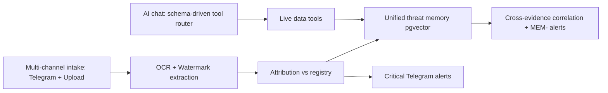
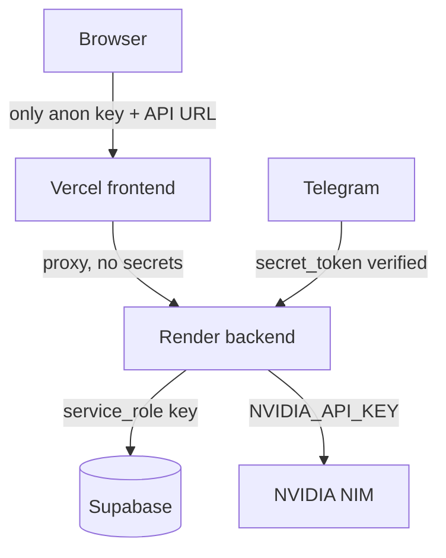
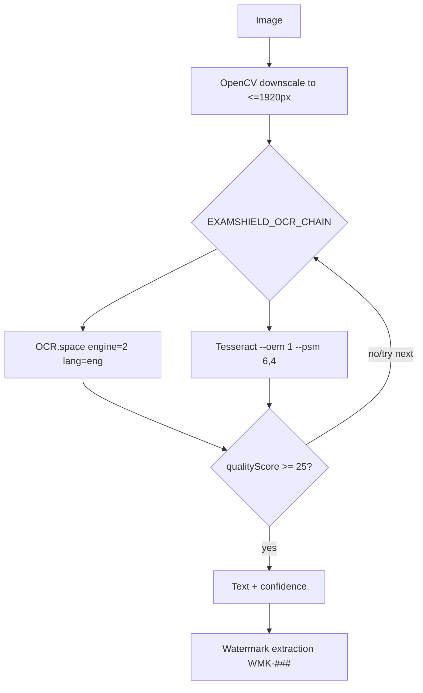

# Faraway ExamShield — Engineering Strengths & Technical Capabilities

> **Scope:** Evidence-based analysis of the strengths, innovations, and technical capabilities of the
> repository at `D:\Projects\Faraway-examshield` (cloned from
> `https://github.com/akyourowngames/Faraway-examshield.git`). Every claim is tied to a concrete file or
> configuration. Items that are partial or inferred are marked **[INFERRED]** / **[UNVERIFIED]**; this
> document deliberately does **not** invent capabilities.

---

## 1. Executive Summary

### 1.1 Vision & objective

**Faraway ExamShield** is an AI-assisted examination-security platform that detects leaked papers in real
time, attributes them via forensic watermarks, correlates repeat leaks across a unified threat memory, and
alerts operators through Telegram. Its objective is to compress what used to be a slow, manual,
human-dependent investigation (monitoring groups, spotting leaks, tracing sources) into an automated,
auditable pipeline.

### 1.2 Technical philosophy

* **One backend process owns everything stateful.** OCR, attribution, alerts, AI chat, and Telegram
  ingestion live in a single Python service (`apps/ai-service`), minimising coordination complexity.
* **Graceful degradation.** Absent Supabase → local JSON/files; absent OCR.space → Tesseract; absent NVIDIA
  key → explicit error. The system is never silently broken.
* **Schema-driven, not keyword-driven, AI.** Tool selection is delegated to an LLM with registered JSON
  schemas; no brittle regex routing (`docs/DEPLOYMENT.md` "Routing rule").
* **Secret isolation by deployment tier.** NVIDIA and Supabase service-role keys live *only* on Render;
  Vercel holds only the anon key + backend URL (`docs/DEPLOYMENT.md`).

### 1.3 Target users & problems solved

* **Educational institutions / exam bodies** (NEET, JEE, UPSC, GATE, CBSE referenced in `detect.py`) — early
  leak detection and source tracing.
* **Security/anti-cheating teams** — a single pane for evidence, alerts, threat map, and investigation.
* **Operators** — natural-language queries over live data via the AI chat, plus Telegram monitoring that
  works without human moderation in groups.

---

## 2. Core Strengths

| # | Strength | Evidence |
|---|----------|----------|
| S1 | Modular, single-responsibility backend modules | `server.py`, `store.py`, `ocr.py`, `pipeline.py`, `tools.py`, `memory.py`, `rag.py`, `telegram.py`, `llm.py`, `planner.py` |
| S2 | Dual-engine OCR with quality gating & fallback chain | `ocr.py`, `ocrspace.py`, `render.yaml` (`EXAMSHIELD_OCR_CHAIN=ocrspace,tesseract`) |
| S3 | Forensic watermark extraction (`WMK-###`) + registry matching | `store.py::extract_watermark_candidates`, `normalize_watermark_id` |
| S4 | Unified threat memory with pgvector + correlation | `memory.py`, `schema.sql` (`examshield_memory_items`, `match_examshield_memory`) |
| S5 | Privacy-first PII redaction before embedding | `memory.py::redact_text` |
| S6 | Schema-driven AI tool routing (no hardcoded prompts) | `planner.py`, `tools.py`, `docs/DEPLOYMENT.md` |
| S7 | Multi-model + multi-provider AI resilience | `llm.py::_candidate_models`, `llm_providers.py` |
| S8 | Secret boundary (Render-only secrets) | `docs/DEPLOYMENT.md`, `render.yaml` `sync:false` |
| S9 | Cookie-based auth via `@supabase/ssr` + middleware protection | `web/src/middleware.ts`, `lib/supabase/*` |
| S10 | Telegram webhook secret verification + silent group monitoring | `telegram.py::validate_secret`, `process_update` |
| S11 | RLS enabled schema foundation + private Storage buckets | `schema.sql` (`enable row level security`, `storage.buckets`) |
| S12 | Graceful local fallback store | `store.py` (JSON collections when Supabase unset) |
| S13 | Centralised, env-driven configuration | `settings.py` (dataclass + fallbacks) |
| S14 | Job recovery & stale-job sweeper | `server.py::recover_interrupted_jobs`, `_start_stale_job_sweeper` |
| S15 | Containerised, reproducible backend | `Dockerfile` (`python:3.12-slim` + Tesseract) |
| S16 | Thin, consistent frontend proxy layer | `web/src/lib/api-proxy.ts`, 23 `app/api/**/route.ts` handlers |
| S17 | Modern, type-safe frontend stack | `web/package.json` (Next 16, React 19, TS 5) |
| S18 | Backend test suite | `apps/ai-service/tests/` (7 test modules) |
| S19 | Serverless embeddings (gte-small, 384-d) | `supabase/functions/embed/index.ts` |
| S20 | Independent, typed registry CLI | `apps/core/` (commander + tsx + schema/seed) |

Each is detailed in later sections.

---

## 3. Technical Innovations

### 3.1 Schema-driven tool router (agentic, not scripted)

`planner.py::ToolPlanner` sends a **router prompt** (`ROUTER_PROMPT`) plus live context from
`tools.planner_context` and the registered tool schemas to a dedicated planner model
(`mistralai/ministral-14b-instruct-2512`). The model may emit a tool call; `normalize_tool_call` maps it to
one of seven tools. If no tool is returned, the session falls back to natural conversation.

* **Why innovative:** It avoids the classic failure mode of "if keyword in text → call tool" routing. The
  LLM decides *whether* live data is needed, which keeps the conversation natural and the data access
  intentional.
* **Engineering complexity:** A second LLM call per chat turn (bounded by `EXAMSHIELD_TOOL_PLANNER_TIMEOUT_SECONDS=4`),
  with a sensible fallback to pure conversation if it times out.

### 3.2 Unified threat memory with cross-evidence correlation

`memory.py` embeds each evidence snippet (via the Supabase `gte-small` edge function) and stores it in
`examshield_memory_items` (pgvector 384). On ingest it runs `correlate_item`, which searches for similar
items and, when `source_count >= 2` (or the signal is `confirmed`), writes a `memory_correlations` record
and raises a `MEM-` alert.

* **Why innovative:** It turns isolated leaks into a *pattern* — the same watermark/center/paper appearing
  across multiple chats becomes an automatic correlation rather than manual stitching.
* **Benefit:** Investigators see recurring sources; the system escalates coordinated leaks automatically.

### 3.3 Forensic watermark pipeline

OCR text is post-processed by `extract_watermark_candidates` → `normalize_watermark_id`, recognising the
`WMK-###` pattern. A match against the registry yields `status=detected` (confidence 100); a format match
with no registry record yields `invalid` (70); otherwise `not-detected`. `final_confidence_score` weights
watermark at 60% / OCR at 40% when a watermark is present.

* **Why innovative:** It couples *content* OCR with *provenance* extraction, enabling source tracing that
  pure text matching cannot.

### 3.4 Silent group monitoring + operator DM chat

`telegram.py::process_update` distinguishes group vs private messages: groups are monitored **silently**
(no bot replies — only detection + evidence ingestion), while private DMs get an LLM-powered operator chat
grounded in real store data (`_handle_chat_message`, `_build_chat_data_context`). This prevents the bot from
 tipping off leak participants in groups.

### 3.5 Graceful multi-tier degradation

The backend is designed to *degrade, not fail*: Supabase → local JSON; OCR.space → Tesseract; NVIDIA →
clear error; vector search → local Jaccard similarity (`memory.py`). This makes local development and
offline demos first-class.

### 3.6 System overview

---

## 4. Security Strengths

> Presented accurately: these are real, verifiable controls. Where the implementation is partial, it is
> stated plainly (see also the companion audit document).

* **Cookie-based session auth (S9).** `@supabase/ssr` (`web/src/lib/supabase/{client,server,middleware}.ts`)
  manages JWT sessions in httpOnly cookies; `middleware.ts` verifies the user on every request and redirects
  unauthenticated users away from `/dashboard` and authenticated users away from `/login`, `/signup`.
* **OAuth support.** Google + GitHub OAuth configured via Supabase (`app/auth/callback/route.ts` exchanges
  the code for a session).
* **Secret boundary (S8).** NVIDIA API key and Supabase `service_role` key are Render-only (`render.yaml`
  sets them `sync:false`); Vercel receives only `NEXT_PUBLIC_SUPABASE_*` and `EXAMSHIELD_API_URL`
  (`docs/DEPLOYMENT.md`). This materially reduces the blast radius of a frontend breach.
* **Service-role isolation.** The backend authenticates to Supabase with the service-role key server-side
  only (`store.py:1631`); the anon key is used by the browser.
* **Telegram webhook secret (S10).** `telegram.py` registers the webhook with a `secret_token` and
  `validate_secret` verifies the `X-Telegram-Bot-Api-Secret-Token` header, rejecting spoofed updates when
  configured.
* **Configurable CORS.** `server.py` emits `Access-Control-Allow-Origin` from `EXAMSHIELD_AI_CORS_ORIGIN`
  (overridable per environment; should be pinned to the Vercel origin in production).
* **RLS foundation (S11).** `schema.sql` calls `enable row level security` on every table and creates
  private Storage buckets (`evidence-files`, `agent-knowledge`). The foundation for least-privilege access
  exists; **[NOTE]** policy definitions are not committed (see audit), but the schema is RLS-ready.
* **PII redaction (S5).** `memory.redact_text` scrubs emails, URLs, handles, phone numbers, and long IDs
  *before* embedding, so the threat memory never stores raw personal identifiers.
* **Input handling.** Multipart uploads are parsed server-side (`cgi.FieldStorage`), and required fields are
  validated (`require_text`).

---

## 5. Architecture Strengths

### 5.1 Clear separation of concerns (S1)

The backend is split into cohesive modules, each with a single dominant responsibility:

| Module | Responsibility |
|--------|---------------|
| `server.py` | HTTP transport, routing, CORS, SSE, multipart |
| `store.py` | Persistence (Supabase + local), watermark, attribution, registry, agents |
| `ocr.py` / `ocrspace.py` | Tesseract / OCR.space engines + quality scoring |
| `pipeline.py` | Orchestration: intake → OCR → alert → memory |
| `workers.py` | Bounded OCR thread pool with dedupe + timeout |
| `tools.py` | Registered live-data tools + answer context |
| `memory.py` | Unified threat memory + correlation + redaction |
| `rag.py` | Agent knowledge ingestion/search |
| `telegram.py` | Webhook, monitoring, alerts, DM chat |
| `llm.py` / `planner.py` / `chat.py` | NVIDIA client, router, SSE chat |
| `settings.py` | Centralised configuration |

This makes the system **readable and individually testable** — a notable strength for a solo/student-grade
codebase.

### 5.2 Service object composition

`build_handler(settings)` constructs singletons (store, telegram, workers, pipeline, llm client, memory,
agent_store) and wires them as class attributes. This is a lightweight dependency-injection pattern with no
framework overhead — appropriate for the deployment model.

### 5.3 API design

REST-ish, resource-oriented endpoints (`/evidence`, `/analysis/jobs`, `/memory`, `/registry`, `/agents`,
`/telegram`, `/chat`, `/plan`, `/ocr/analyze`). Health endpoint (`/health`) exposes rich runtime state
(model, OCR runtime, storage backend, Telegram status, memory status) — valuable for ops.

### 5.4 Database design

Two complementary stores: a flexible JSON document table (`examshield_documents`, keyed
`(collection, document_key)`) for rapidly evolving entities, and strongly-typed relational tables
(`community_agents`, `agent_*`) for the agent subsystem; plus pgvector tables for similarity. This balances
speed of development with structure where it matters.

### 5.5 Future expansion

The tool registry (`tools.py`) and provider registry (`llm_providers.py`) are open-closed: new live-data
tools or LLM providers can be added without touching request routing. The `examshield_documents` bag makes
new entity types cheap to introduce.

---

## 6. Frontend Strengths

* **Modern App Router (S17).** Next.js 16 + React 19 Server/Client Components; `web/src/app` is cleanly
  organised into `login`, `signup`, `auth/callback`, `dashboard/*`, `evidence`, `memory`, `telegram`, and
  `api`.
* **Thin, consistent proxy layer (S16).** `web/src/lib/api-proxy.ts` provides `proxyApi` /
  `proxyStreamApi` with configurable timeout (`EXAMSHIELD_API_TIMEOUT_MS=28000`), retries
  (`EXAMSHIELD_API_RETRIES=2`) on `408/429/502/503/504`, and `AbortController` timeouts, then forwards
  relevant headers. All 23 `app/api/**/route.ts` handlers reuse it — DRY and uniform.
* **Typed data layer.** `agent-api.ts`, `agent-types.ts`, `evidence-types.ts`, `analysis-client.ts`,
  `evidence-format.ts` give the UI a typed contract against the backend.
* **Design system.** Tailwind v4 CSS-first theme in `globals.css` (@theme tokens), `cn()` utility
  (`clsx`+`tailwind-merge`), `lucide-react` icons, `framer-motion` animation, `recharts` charts, and
  `react-simple-maps` + `@svg-maps/india` for the threat map.
* **Auth-aware navigation.** `middleware.ts` + `AuthRedirectHandler.tsx` handle post-auth redirects.
* **Streaming UI ready.** `proxyStreamApi` + SSE consumption support a live, token-streamed AI chat.

---

## 7. Backend Strengths

* **Business logic organisation (S1).** As in §5.1, responsibilities are cleanly partitioned.
* **OCR processing (S2).** `analyze_image` walks `EXAMSHIELD_OCR_CHAIN` within a total budget
  (`EXAMSHIELD_OCR_TOTAL_BUDGET_SECONDS=120`), tries each engine, and accepts the first candidate whose
  `qualityScore >= EXAMSHIELD_OCR_MIN_QUALITY (25)`. Images are downscaled with OpenCV to
  `EXAMSHIELD_OCR_MAX_DIMENSION=1920` to stay within CPU budgets.
* **AI integration (S7).** `NvidiaClient` posts to `{base_url}/chat/completions` with automatic model
  fallback (`_candidate_models` iterates primary + `fallback_models`), both for JSON and SSE streaming —
  resilient to a single model outage.
* **Database interaction.** A single `EvidenceStore` abstraction hides Supabase vs local JSON behind one API,
  so callers never branch on storage backend.
* **Error handling.** Handlers return structured `{"error": ...}` payloads with appropriate HTTP statuses;
  OCR returns a completed/failed result rather than throwing; worker failures mark jobs `failed`.
* **Logging.** `logging.basicConfig` with timestamp/level/logger — sufficient for containerised stdout
  capture.
* **Reliability (S14).** `recover_interrupted_jobs` re-queues jobs left `processing` after a restart, and a
  daemon `stale-job-sweeper` cleans jobs older than `EXAMSHIELD_STALE_JOB_MAX_AGE_SECONDS`.
* **Extensibility.** `ExamshieldToolRegistry` and `PROVIDER_REGISTRY` make adding tools/providers additive.

---

## 8. Database Strengths

* **pgvector-native similarity (S4).** `examshield_memory_items.embedding extensions.vector(384)` with an
  HNSW index (`vector_cosine_ops`) and a `match_examshield_memory` SQL function (threshold 0.76) — first-class
  vector search inside Postgres, no separate vector DB.
* **Agent knowledge vectors.** `agent_knowledge_chunks.embedding vector(384)` + `match_agent_knowledge`
  (threshold 0.7) for RAG.
* **RLS foundation (S11).** Every table has `enable row level security`; private Storage buckets created via
  `insert into storage.buckets`.
* **Indexes.** HNSW on embeddings; B-tree indexes on `source_evidence_id`, hashes `(content_hash,
  fingerprint_hash)`, `(status, severity)`, `category`, `visibility`, `agent_id`, `source_id`.
* **Extensions.** `vector` and `pgcrypto` (for `gen_random_uuid()`) enabled explicitly.
* **Soft-typed flexibility.** The `examshield_documents` JSON bag lets the product iterate quickly on
  evidence/job/report shapes without migrations for every field change.

---

## 9. AI & OCR Strengths

### 9.1 OCR workflow (S2)

* **Dual engine, ordered fallback.** Cloud OCR.space first (higher quality), then on-prem Tesseract — best
  of both, with cost control via chain order.
* **Quality gating.** `score_ocr_quality` combines confidence, language ratio, structure, and cleanliness
  with penalties, preventing low-value text from polluting downstream attribution.
* **Preprocessing.** OpenCV downscale/compression keeps OCR within time budgets and OCR.space size limits.
* **OCR.space resilience.** `ocrspace.py` retries with base64 payload on HTTP 403; compresses uploads to ≤
  900 KB.

### 9.2 AI pipeline (S6, S7)

* **Planner + tool execution.** The router decides *if* live data is needed; tools return structured
  `result` + `model_context` (≤7000 chars) injected into a grounded prompt so the LLM answers strictly from
  real data (`responses.grounded_messages` answer-rules forbid fabrication).
* **Model resilience.** Primary `meta/llama-4-maverick-17b-128e-instruct` with fallbacks
  `mistralai/ministral-14b-instruct-2512`, `deepseek-ai/deepseek-v4-flash`; planner uses
  `ministral-14b`. Failures iterate candidates rather than failing outright.
* **Multi-provider for agents.** `llm_providers.py` supports OpenAI, Anthropic, Grok, Groq, OpenCode Zen with
  provider-specific payload/header builders and key validation — letting community agents use the operator's
  chosen LLM.
* **Streaming.** `stream_chat` emits SSE tokens; the frontend renders them live.
* **Embeddings.** `gte-small` via Supabase Edge (`mean_pool`, `normalize`) produces consistent 384-d vectors
  for both memory and RAG, with token auth on the function.

### 9.3 Practical advantages

* Automated, auditable evidence → attribution → alert loop.
* Natural-language investigation ("show me compromised papers") over live data.
* Repeat-leak correlation that humans would miss at scale.

---

## 10. Performance Strengths

* **OCR budget control.** A hard total budget (`120s`) and per-engine timeouts (`45s`) bound worst-case
  latency; images are downscaled so Tesseract stays fast on CPU.
* **Worker pool with dedupe.** `AnalysisWorkerPool` caps concurrency (`max_workers=2`), dedupes identical
  evidence/jobs, and enforces a per-job timeout (`120s`), preventing runaway OCR from exhausting the process.
* **Streaming responses.** AI answers stream token-by-token (SSE), so perceived latency is low even before
  the full response is ready.
* **Planner bounded.** Tool routing has a `4s` timeout and falls back to conversation if it exceeds it.
* **Edge embeddings.** Embedding runs as a Supabase Edge Function (`gte-small`) — fast, serverless, and
  colocated with the database, avoiding a separate ML service.
* **List caching.** `EXAMSHIELD_LIST_CACHE_TTL_SECONDS=8` caches collection listings in memory to reduce
  repeated reads.
* **[INFERRED]** Next.js 16 App Router enables server components and code-split routes; `framer-motion`/
  `recharts`/`react-simple-maps` are client components localised to the dashboard.

---

## 11. Developer Experience

* **Centralised config (S13).** `settings.py` is a single `dataclass` with env reads and sensible fallbacks
  (model names, ports, thresholds, timeouts) — one place to reason about behaviour.
* **Type safety (S17).** TypeScript across `web/` and `apps/core/`; `web/tsconfig.json` enables path aliases
  (`@/*`) and strict-ish checking; `agent-types.ts`/`evidence-types.ts` give shared contracts.
* **Linting.** `eslint.config.mjs` (flat config) wires `eslint-config-next` `core-web-vitals` + `typescript`.
* **Documentation (S18-adjacent).** README is detailed; `docs/DEPLOYMENT.md` and `docs/TELEGRAM_SETUP.md`
  give step-by-step setup; `apps/ai-service/README.md` documents the API surface.
* **Backend tests (S18).** `apps/ai-service/tests/` covers OCR, OCR.space, analysis flow, store snapshot,
  Telegram pipeline, and workers — a real safety net for the core logic.
* **Reproducible backend.** `requirements.txt` is minimal (OpenCV + pytest); the Dockerfile pins
  `python:3.12-slim` and installs Tesseract deterministically.
* **Independent CLI.** `apps/core` is a self-contained TypeScript registry CLI (commander + tsx) with
  `seed`/`query`/`stats` scripts — usable without the web stack.

---

## 12. Deployment Strengths

* **Containerised backend (S15).** `Dockerfile` builds a small, reproducible image with Tesseract + `libgomp1`
  (OpenCV threading) and `PYTHONPATH=/app/apps/ai-service` so `import examshield_ai` resolves.
* **Render Blueprint (S15).** `render.yaml` declaratively defines the `examshield-api` web service (Docker,
  free plan, `healthCheckPath: /health`, env vars) — one-click deploy from GitHub.
* **Vercel frontend.** Root `vercel.json` sets `framework: nextjs`, install with `legacy-peer-deps`,
  `buildCommand: cd web && npm run build`, `outputDirectory: web/.next` — standard, reliable Vercel flow.
* **Environment separation (S8).** Secrets are split by tier: Vercel knows only the anon key + API URL;
  Render holds the service-role + NVIDIA + Telegram secrets (`sync:false`).
* **Health check.** `/health` reports storage backend, OCR runtime, memory status, Telegram config, and model
  — a meaningful liveness/readiness signal.
* **[NOTE]** There is no CI workflow in this clone (see audit); deployment is manual/Git-triggered rather than
  gated. This is a gap, not a strength, but the *deployment definitions themselves* (Dockerfile + render.yaml +
  vercel.json) are clean and production-shaped.

---

## 13. Reliability Features

* **Job recovery (S14).** `recover_interrupted_jobs` re-queues OCR jobs left `processing` after a restart —
  important on Render free tier, which spins down.
* **Stale-job sweeper (S14).** A daemon thread periodically cleans jobs older than the max age, preventing
  stuck `processing` states from blocking re-analysis.
* **OCR worker timeout + dedupe.** Prevents a single bad image from hanging the pool or double-processing.
* **Graceful degradation.** Each external dependency has a fallback or clear error (§3.5).
* **Structured error payloads.** Endpoints return `{"error": ...}` with status codes; the chat path emits an
  explicit SSE `error` event when NVIDIA is unconfigured.
* **Validation.** Required multipart/JSON fields are checked (`require_text`, `_read_json`); Telegram secret
  verified before processing.

---

## 14. Scalability Analysis

* **Modular growth.** New tools (`tools.py`), providers (`llm_providers.py`), and entity collections
  (`examshield_documents`) are additive — the architecture supports feature growth without restructuring.
* **Stateless-ish API.** The service holds little per-request server state; Supabase is the system of record,
  so horizontal replication is feasible once a production WSGI/ASGI server and a queue replace the stdlib
  server + in-process pool (see audit).
* **Vector search scales with pgvector.** HNSW indexes keep similarity search sub-linear; thresholds are
  tunable (`EXAMSHIELD_MEMORY_MATCH_THRESHOLD`, agent `0.7`).
* **Storage offloaded.** Files live in Supabase Storage, not the container — the ephemeral Render filesystem
  is not a data-risk when Supabase is configured (per `docs/DEPLOYMENT.md`).
* **[INFERRED]** Enterprise readiness today is partial: single-process backend and free tier are demo-grade,
  but the *abstractions* (store, workers, tools, providers) are the right shape for scaling.

---

## 15. Competitive Advantages

| Capability | Manual / traditional monitoring | ExamShield (this repo) |
|------------|-------------------------------|------------------------|
| Leak detection | Human moderators scanning groups | Automated OCR + keyword/URL scoring on every message (`detect.py`) |
| Source tracing | Eyewitness/guesswork | Forensic watermark extraction + registry match (`store.py`) |
| Cross-case linkage | None / spreadsheets | Unified pgvector memory + auto-correlation (`memory.py`) |
| Response time | Hours–days | Near-real-time Telegram alerts + AI chat |
| Evidence integrity | Screenshots saved ad hoc | Structured evidence bundles + activity timeline |
| Operator load | High, repetitive | Natural-language queries over live data (`planner.py`) |
| Multi-channel | Separate tools | One pipeline for upload + Telegram groups + DMs |

All advantages are rooted in repository capabilities (not marketing): OCR chain, watermark regex, vector
memory, Telegram integration, and the schema-driven agent.

---

## 16. Real-world Benefits

* **Educational institutions / exam bodies:** earlier leak detection, defensible attribution, and an audit
  trail (activity feed, evidence bundles).
* **Universities / government exams:** a single pane (dashboard) correlating leaks across regions via the
  threat map and memory correlations.
* **Private certification bodies:** community-agent subsystem lets them build branded, RAG-backed assistants
  on their own knowledge (`rag.py`, `agent_*` tables).
* **Administrators / security teams:** automated alerts, severity scoring, and AI-assisted investigation
  reduce manual triage.
* **Students (indirect):** faster takedown of leaked material protects exam integrity.

---

## 17. Engineering Best Practices

* **TypeScript + strict module boundaries** (`web/`, `apps/core/`).
* **Separation of concerns** in the backend (§5.1).
* **Single source of configuration** (`settings.py`).
* **Open-closed extension points** (tool registry, provider registry).
* **Graceful degradation** at every external dependency.
* **Secret tiering** (Render-only secrets).
* **RLS-enabled, private-bucket** database foundation.
* **Automated tests** for the riskiest backend logic.
* **Reproducible builds** (Dockerfile + lockfile at `web/package-lock.json`).
* **Schema-driven AI** (no brittle prompt hacks).
* **Privacy redaction** before embedding.

---

## 18. Future Potential

Based on the current architecture (not invented features):
* Add RLS **policies** and a dedicated backend DB role on top of the existing RLS-enabled schema.
* Replace the stdlib HTTP server with an ASGI server + a durable queue (the worker/pipeline abstractions
  already exist).
* Promote `apps/vision` (YOLO) from experimental to a second OCR/pre-filter signal, and productize
  `apps/broadcast-agent`.
* Add caching (Redis/edge) for lists and embeddings lookups.
* Extend watermark/registry matching to regional-language OCR.
* Introduce cost guardrails (per-tenant AI/OCR quotas) leveraging the existing settings layer.

---

## 19. SWOT Analysis

| | |
|---|---|
| **Strengths** | Modular backend; dual OCR + quality gating; forensic watermark + registry; unified pgvector threat memory + correlation; schema-driven AI tool routing; multi-model/provider resilience; secret tiering; cookie auth + middleware protection; Telegram webhook-secret + silent group monitoring; RLS-enabled schema; graceful degradation; containerised deploy; backend tests; modern Next 16/React 19 frontend; typed data layer. |
| **Weaknesses** | No RLS **policies** (service-role trust); unauthenticated backend API; plaintext agent keys; RAG embeddings stored as strings (functional bug); `fitz` missing from requirements; default `CORS=*`; no rate limiting; binary auth (no RBAC); single-process Python + free tier; JSONB document bag; no CI/migrations; no frontend tests; god modules. *(See PROJECT_WEAKNESSES_AUDIT.md for detail.)* |
| **Opportunities** | Exam-integrity market; community-agent marketplace; multi-tenant SaaS; regional-language support; enterprise SOCs; GPU/batch OCR; partner integrations (LMS, government portals). |
| **Threats** | Adversarial Telegram users (prompt injection, obfuscated leaks); OCR evasion (rotated/scanned watermarks); cost volatility of external AI/OCR APIs; supply-chain/dependency risk; competitors with deeper ML; regulatory handling of monitored communications. |

---

## 20. Key Takeaways

### Top 20 technical strengths
1. Modular, single-responsibility backend (S1)
2. Dual-engine OCR with quality gating + fallback (S2)
3. Forensic watermark extraction + registry match (S3)
4. Unified pgvector threat memory + correlation (S4)
5. Privacy-first PII redaction (S5)
6. Schema-driven AI tool routing (S6)
7. Multi-model + multi-provider AI resilience (S7)
8. Secret boundary (Render-only secrets) (S8)
9. Cookie auth + middleware route protection (S9)
10. Telegram webhook-secret + silent group monitoring (S10)
11. RLS-enabled schema + private buckets (S11)
12. Graceful local fallback store (S12)
13. Centralised env-driven configuration (S13)
14. Job recovery + stale-job sweeper (S14)
15. Containerised reproducible backend (S15)
16. Thin consistent frontend proxy (S16)
17. Modern type-safe frontend stack (S17)
18. Backend test suite (S18)
19. Serverless gte-small embeddings (S19)
20. Independent typed registry CLI (S20)

### Top innovations
* Schema-driven (not keyword-driven) tool router.
* Unified, privacy-redacted threat memory with automatic cross-evidence correlation.
* Forensic watermark → registry → confidence scoring pipeline.
* Silent group monitoring with operator-only DM chat.

### Most impressive engineering decisions
* One backend process owning OCR, attribution, alerts, AI, and Telegram — minimal coordination.
* Graceful degradation at every boundary (Supabase / OCR.space / NVIDIA / vector search).
* Secret tiering so a frontend breach cannot reach the service-role key or NVIDIA key.
* Tool/provider registries that make the system open-closed for extension.

### Production-readiness note
The engineering *foundations* are strong and the feature set is impressive for the domain. Per the companion
audit (`PROJECT_WEAKNESSES_AUDIT.md`), the project is **best suited to a pilot/MVP with trusted operators**
until the P0 security items (RLS policies, API authentication, key encryption) are addressed. The architecture
is shaped correctly to reach small-production scale with targeted hardening.

---

*End of document. All strengths are grounded in the cloned repository; items marked **[INFERRED]** /
**[NOTE]** / **[UNVERIFIED]** indicate where nuance or partial implementation was noted during review.*
