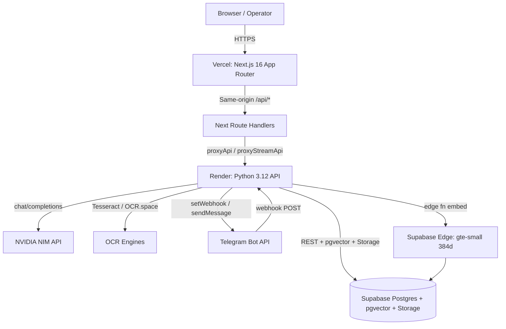
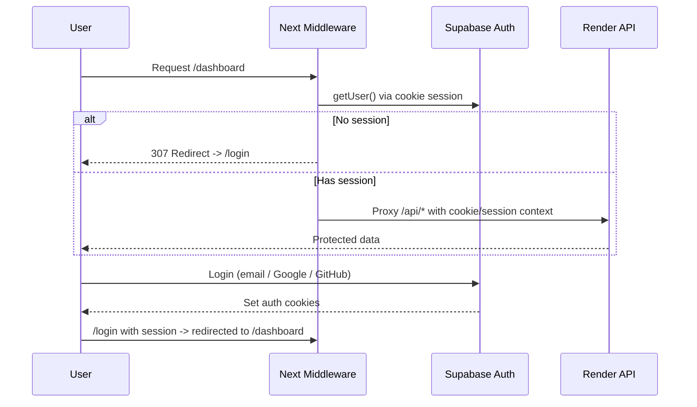
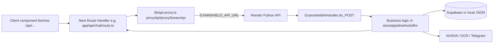
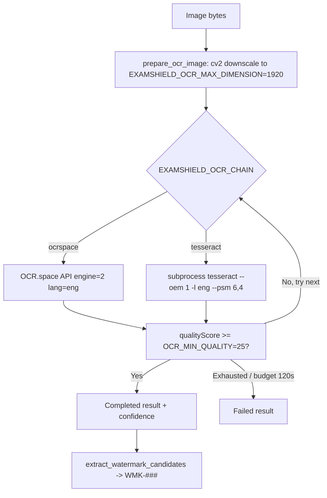
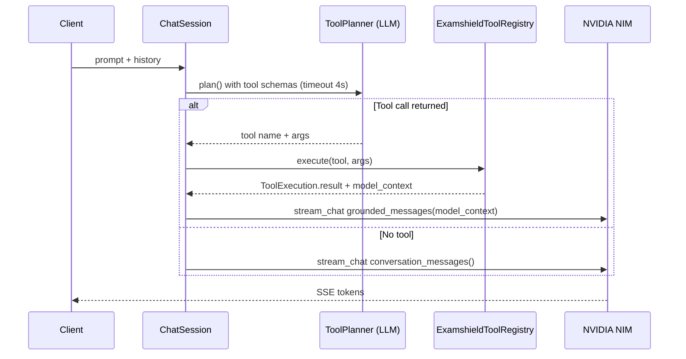
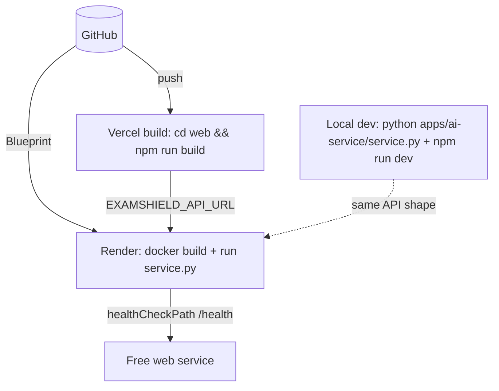
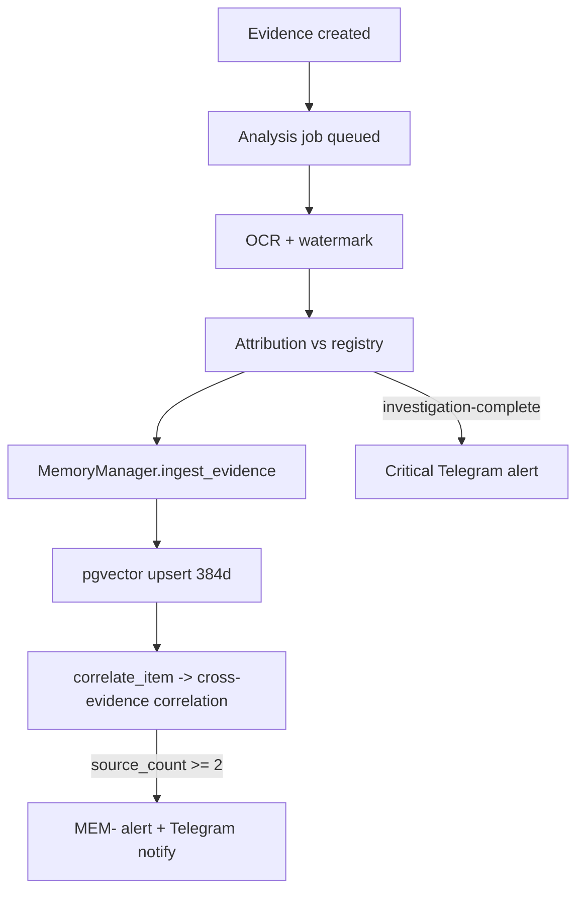
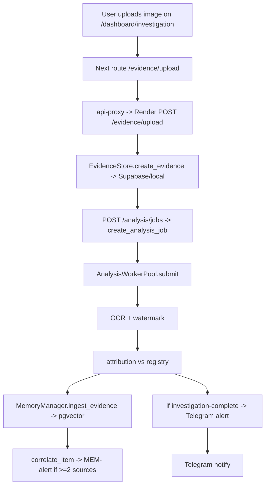
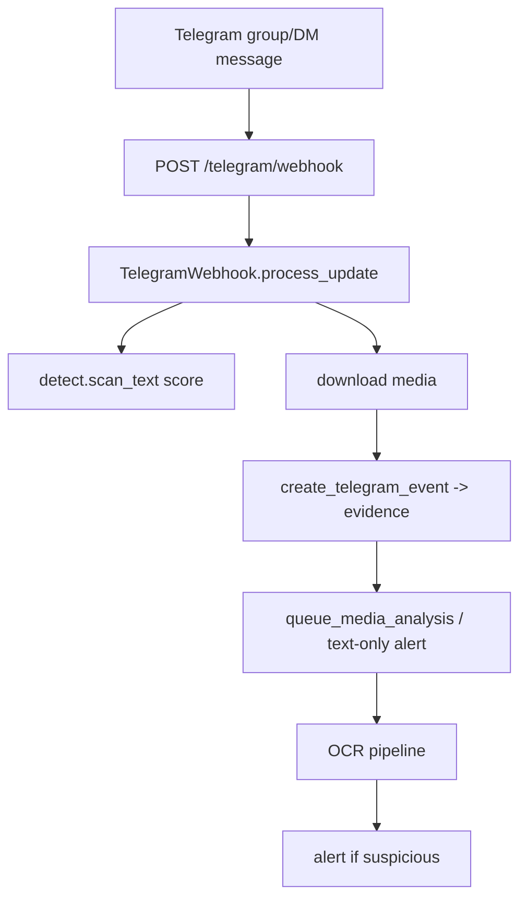

# Faraway ExamShield

## Complete Technology Stack & System Architecture Documentation


---

## Table of Contents

1. [Executive Overview](#1-executive-overview)
2. [High Level Architecture](#2-high-level-architecture)
3. [Complete Technology Stack](#3-complete-technology-stack)
4. [Repository Structure](#4-repository-structure)
5. [Dependency Audit](#5-dependency-audit)
6. [Backend Architecture](#6-backend-architecture)
7. [Frontend Architecture](#7-frontend-architecture)
8. [Database Architecture](#8-database-architecture)
9. [Authentication Architecture](#9-authentication-architecture)
10. [OCR Pipeline](#10-ocr-pipeline)
11. [AI Pipeline](#11-ai-pipeline)
12. [Third-party Integrations](#12-third-party-integrations)
13. [Security Architecture](#13-security-architecture)
14. [Deployment Architecture](#14-deployment-architecture)
15. [Configuration Files](#15-configuration-files)
16. [Environment Variables](#16-environment-variables)
17. [Data Flow](#17-data-flow)
18. [File-by-File Technology Mapping](#18-file-by-file-technology-mapping)
19. [Build Process](#19-build-process)
20. [Runtime Architecture](#20-runtime-architecture)
21. [Engineering Decisions](#21-engineering-decisions)
22. [Future Improvements](#22-future-improvements)
23. [Complete Technology Summary](#23-complete-technology-summary)

---

## 1. Executive Overview

### 1.1 What this project is

**Faraway ExamShield** (stylised `EXAMSHIELD`) is an AI-assisted examination-security platform
designed to detect, attribute, and respond to leaked examination papers. It monitors channels where
leaks appear (Telegram groups and direct messages, plus manual uploads), applies OCR to images,
extracts forensic watermarks, matches the recovered content against a registry of protected papers,
and raises alerts. The system is presented to operators through a Next.js 16 dashboard that proxies
to a single Python backend service.

The repository is a **monorepo without a workspace manager** (no Turborepo / Nx / Lerna). It is
organised as a flat set of directories at the root (`apps/`, `web/`, `supabase/`, `docs/`) coordinated
by independent tooling (Docker, Render Blueprints, Vercel, a Python `requirements.txt`, and per-app
`package.json` files).

### 1.2 Purpose

The product mission, stated in `README.md`, is to *"prevent academic integrity violations at scale —
detect paper leaks in real-time, trace watermark sources across the forensic chain, and alert
authorities before compromised exams reach students."* The platform targets national-level
examination bodies (the detection rules reference NEET, JEE, UPSC, GATE, and CBSE papers).

### 1.3 Overall architecture

The system is a classic **thin-frontend + single backend + managed data/AI services** topology:

* **Frontend** — Next.js 16 (App Router) + React 19, deployed on Vercel.
* **Backend** — One Python 3.12 process (`apps/ai-service`) that exposes a hand-rolled HTTP API
  (`http.server.ThreadingHTTPServer`), deployed on Render as a Docker container.
* **Database & Storage** — Supabase (PostgreSQL + `pgvector` + Storage), accessed server-side with the
  service-role key. When Supabase credentials are absent, the backend degrades gracefully to a
  local-JSON + local-files store for offline development.
* **AI** — NVIDIA NIM (`integrate.api.nvidia.com/v1`) chat completions, with a multi-provider fallback
  registry (`llm_providers.py`) for the community-agents subsystem.
* **OCR** — A two-engine chain: OCR.space (cloud) and Tesseract (system package in the Docker image),
  orchestrated by `ocr.py`.
* **Embeddings** — A Supabase Edge Function (`supabase/functions/embed`) running the `gte-small`
  model to produce 384-dimensional vectors for threat-memory correlation and agent RAG.
* **Notifications** — Telegram Bot API for both inbound monitoring (webhook) and outbound alerts /
  operator chat.

### 1.4 Engineering goals & design philosophy

* **One backend process.** All OCR, analysis, attribution, alerts, chat, and Telegram ingestion live
  in a single Python service to minimise coordination complexity (`apps/ai-service/README.md`).
* **Zero-trust secret boundary.** NVIDIA and Supabase service-role keys live *only* on Render; Vercel
  holds only the public Supabase anon key and the backend URL (`docs/DEPLOYMENT.md`).
* **Schema-driven tool routing.** The AI agent selects tools from registered JSON schemas, never via
  hardcoded keyword/regex/prompt shortcuts — see `docs/DEPLOYMENT.md` "Routing rule".
* **Graceful degradation.** Absent Supabase → local JSON/files. Absent OCR.space key → Tesseract only.
  Absent NVIDIA key → explicit "not configured" error rather than silent failure.
* **Privacy-first memory.** PII (emails, URLs, handles, phone numbers, long IDs) is redacted before
  being embedded into the unified threat memory (`memory.py::redact_text`).

---

## 2. High Level Architecture

### 2.1 System architecture



### 2.2 Authentication flow



### 2.3 Request lifecycle (frontend → backend)



### 2.4 OCR pipeline



### 2.5 AI chat & tool routing



### 2.6 Deployment architecture



### 2.7 Evidence / memory flow



---

## 3. Complete Technology Stack

This section enumerates every technology found in the repository, with version, rationale, file
references, advantages, limitations, and alternatives.

### 3.1 Programming languages

| Language | Version | Where | Purpose |
|----------|---------|-------|---------|
| TypeScript | `^5` (web), `^5.5.0` (core) | `web/`, `apps/core/` | Frontend + registry CLI |
| JavaScript | ES2022 modules | `web/src` | React/Next runtime |
| Python | `3.12` (Docker `python:3.12-slim`) | `apps/ai-service/`, `apps/vision/` | Backend API, OCR, vision |
| SQL | Postgres (Supabase) | `supabase/schema.sql` | Schema, RLS, vector search |
| Deno | Supabase Edge runtime | `supabase/functions/embed/index.ts` | Embedding serverless fn |

### 3.2 Frontend framework

* **Next.js 16.2.7** (`web/package.json`, root `package.json`). App Router (`web/src/app`), React 19
  Server + Client Components, route handlers under `app/api`. `next.config.ts` is intentionally
  minimal (no custom config).
* **React 19.2.4** / **react-dom 19.2.4** — concurrent rendering, Server Components.
* **Advantages:** file-based routing, server components for auth, easy API proxy routes, first-class
  Vercel deployment.
* **Limitations:** App Router caching/streaming nuances; requires React 19 peer compatibility (hence
  `legacy-peer-deps`).
* **Alternatives considered / not used:** Remix, SvelteKit, plain Express + React SPA.

### 3.3 Styling

* **Tailwind CSS v4** (`tailwindcss: ^4`, `@tailwindcss/postcss: ^4`). CSS-first configuration via
  `@import "tailwindcss"` and `@theme { ... }` in `web/src/app/globals.css` (no `tailwind.config.js`).
* **PostCSS** via `postcss.config.mjs` → `@tailwindcss/postcss`.
* **clsx `^2.1.1`** + **tailwind-merge `^3.6.0`** → `cn()` helper in `web/src/lib/utils.ts`.
* Design language: pure-black command-center theme (`--color-background: #000000`), Oswald/Inter
  fonts, uppercase headings, noise texture (`globals.css`).

### 3.4 UI components & animation

* **framer-motion `^12.40.0`** — page/section animations, `FloatingParticles.tsx`.
* **lucide-react `^1.17.0`** — icon set.
* **recharts `^3.8.1`** — charts (threat posture, stats).
* **react-simple-maps `^3.0.0`** + **@types/react-simple-maps `^3.0.6`** + **@svg-maps/india `^2.0.0`**
  — `ThreatMap.tsx` geographic visualisation of leak hotspots across India.

### 3.5 Backend (Python)

* **Standard library only** for HTTP (`http.server.ThreadingHTTPServer`, `BaseHTTPRequestHandler`),
  JSON, multipart parsing (`cgi.FieldStorage`), URL fetch (`urllib.request`), SSE.
  Entrypoint: `apps/ai-service/service.py` → `examshield_ai.server.main`.
* **opencv-python-headless `>=4.8.0`** (`requirements.txt`) — used by `ocr.py`/`ocrspace.py` to
  downscale/compress images before OCR.
* **pytest `>=8.0`** — tests under `apps/ai-service/tests/`.
* **Advantages:** zero web-framework dependency, tiny image, easy to containerise.
* **Limitations:** manual routing, no ASGI concurrency model, single-process threading (Render free
  tier suffices for the workload), no OpenAPI schema generation, manual CORS.
* **Alternatives:** FastAPI/Flask would reduce boilerplate but add dependencies and a different
  concurrency model.

### 3.6 Database & storage

* **Supabase** = hosted Postgres + `pgvector` + Storage + Auth + Edge Functions.
* **pgvector 384-dim** for `examshield_memory_items.embedding` and
  `agent_knowledge_chunks.embedding` (HNSW index, cosine distance).
* **Storage buckets:** `evidence-files` (private), `agent-knowledge` (private).
* **Local fallback:** JSON collection files under `apps/api/uploads/evidence/*` when Supabase is
  unset.

### 3.7 AI services

* **NVIDIA NIM** (`https://integrate.api.nvidia.com/v1`, configurable via `NVIDIA_NIM_BASE_URL`).
  Primary model `meta/llama-4-maverick-17b-128e-instruct`; planner model
  `mistralai/ministral-14b-instruct-2512`; fallbacks `mistralai/ministral-14b-instruct-2512`,
  `deepseek-ai/deepseek-v4-flash`.
* **Multi-provider registry** (`llm_providers.py`): OpenAI, Anthropic, Grok (xAI), Groq, OpenCode Zen
  — used for the community-agents subsystem and key validation.
* **Supabase Edge embedding** (`gte-small`, 384-d) for memory + RAG.

### 3.8 OCR

* **Tesseract OCR** (system package in Docker: `tesseract-ocr`, `libgomp1`). `--oem 1`, `--psm 6,4`,
  English.
* **OCR.space** cloud API (`api.ocr.space/parse/image`, engine 2, English). Optional (keyless →
  skipped).
* **OpenCV** for preprocessing (downscale to 1920px max, JPEG compression for OCR.space upload ≤
  900 KB).

### 3.9 Authentication

* **@supabase/ssr `^0.12.0`** + **@supabase/supabase-js `^2.108.1`** — cookie-based session auth.
* Email/password, Google OAuth, GitHub OAuth (configured in Supabase project, referenced in README).
* Middleware protects `/dashboard`.

### 3.10 Developer tooling

* **eslint `^9`** + **eslint-config-next 16.2.7** (flat config `eslint.config.mjs`,
  `core-web-vitals` + `typescript`).
* **typescript `^5`**, **@types/node `^20`**, **@types/react `^19`**, **@types/react-dom `^19`**.
* **tsx `^4.19.0`** (core CLI runner), **commander `^12.1.0`**, **chalk `^5.3.0`** (registry CLI).
* **.npmrc** with `legacy-peer-deps=true` (React 19 peer tolerance).

### 3.11 Deployment / DevOps

* **Docker** (`Dockerfile`, `python:3.12-slim`).
* **Render** (`render.yaml`, Docker runtime, free plan, health check `/health`).
* **Vercel** (`vercel.json`, `web/.next` output).
* **GitHub** as source of truth (Render Blueprint + Vercel Git integration). **[UNVERIFIED]** No
  `.github/` CI workflows exist in this clone.

### 3.12 Utilities & libraries (frontend)

* **clsx**, **tailwind-merge** (see styling).
* `web/src/lib/agent-api.ts` — typed fetch wrapper for `/api/*` agents endpoints.
* `web/src/lib/analysis-client.ts`, `evidence-types.ts`, `evidence-format.ts`, `map-centers.ts`,
  `use-evidence-feed.ts` (React hook for SSE/feed).

### 3.13 Monitoring / logging

* Python `logging` (`logging.basicConfig`, `%(asctime)s - %(name)s - %(levelname)s - %(message)s`).
* Activity feed stored as JSON (`activity` collection) and surfaced in the dashboard.
* **[UNVERIFIED]** No external APM/observability integration (Datadog, Sentry) is present in source.

---

## 4. Repository Structure

```text
Faraway-examshield/
├── apps/
│   ├── ai-service/            # Python 3.12 unified API (OCR/AI/Telegram/evidence)
│   │   ├── examshield_ai/      # backend modules (server, store, ocr, llm, ...)
│   │   ├── tests/              # pytest suite
│   │   ├── requirements.txt
│   │   ├── service.py          # entrypoint
│   │   └── README.md
│   ├── api/uploads/evidence/   # local JSON/file fallback store (.gitkeep dirs)
│   ├── core/                   # TypeScript paper-registry CLI (chain of custody data layer)
│   │   ├── cli.ts, lib/{query,schema,seed,test}.ts
│   │   └── data/papers.json     # registry source (generated/seed)
│   ├── vision/                 # [EXPERIMENTAL] YOLO11n leak detection (not wired in)
│   └── broadcast-agent/        # [STUB] only .env.example present, no implementation
├── web/                        # Next.js 16 frontend (Vercel)
│   └── src/
│       ├── app/                # routes, pages, api handlers
│       ├── components/         # UI components
│       ├── lib/               # supabase clients, api-proxy, data layer
│       └── middleware.ts
├── supabase/
│   ├── schema.sql              # DB schema, RLS enable, pgvector, buckets, SQL fns
│   └── functions/embed/index.ts  # Deno edge embedding (gte-small)
├── docs/                       # DEPLOYMENT.md, TELEGRAM_SETUP.md, (this file)
├── Dockerfile
├── render.yaml
├── vercel.json
├── package.json               # root (just next + scripts)
├── README.md
└── .gitignore / .dockerignore
```

### 4.1 Folder responsibilities & relationships

* **`apps/ai-service`** is the brain. It owns all stateful processing. Talks to Supabase (data),
  NVIDIA (AI), Tesseract/OCR.space (OCR), Telegram (ingest/alerts), and the embed edge fn
  (vectors). It is the single source of truth the frontend proxies to.
* **`web`** is a presentation + proxy layer. It holds no secrets beyond the Supabase anon key and
  backend URL. Route handlers in `web/src/app/api/**` are thin pass-throughs (`proxyApi`).
* **`apps/core`** is an independent CLI that manages the *paper registry* (`papers.json`), a curated
  list of protected papers/watermarks the backend matches evidence against. The backend reads the
  registry from `apps/core/data/papers.json` by default (`settings.registry_path`).
* **`supabase`** holds declarative DB state (schema + edge function). It is applied manually via the
  Supabase SQL editor (no `supabase/migrations/` directory exists in this clone).
* **`apps/vision`** and **`apps/broadcast-agent`** are exploratory/stub modules (see §22 risks).

---

## 5. Dependency Audit

### 5.1 `web/package.json` (production)

| Category | Package | Version | Why it exists |
|----------|---------|---------|---------------|
| Framework | `next` | `16.2.7` | App Router frontend + API routes + Vercel target |
| UI runtime | `react` / `react-dom` | `19.2.4` | Component model, server components |
| Auth | `@supabase/ssr` | `^0.12.0` | Cookie-based session auth (server + browser) |
| Auth | `@supabase/supabase-js` | `^2.108.1` | Supabase client core |
| Styling | `tailwind-merge` | `^3.6.0` | Merge Tailwind classes safely |
| Styling | `clsx` | `^2.1.1` | Conditional class names |
| Animation | `framer-motion` | `^12.40.0` | Motion/transitions |
| Icons | `lucide-react` | `^1.17.0` | Icon set |
| Charts | `recharts` | `^3.8.1` | Threat/stats charts |
| Maps | `react-simple-maps` | `^3.0.0` | SVG map for `ThreatMap` |
| Maps (types) | `@types/react-simple-maps` | `^3.0.6` | TS types |

### 5.2 `web/package.json` (development)

| Category | Package | Version | Why |
|----------|---------|---------|-----|
| Maps data | `@svg-maps/india` | `^2.0.0` | India topology for threat map |
| CSS | `@tailwindcss/postcss` | `^4` | Tailwind v4 PostCSS plugin |
| CSS | `tailwindcss` | `^4` | Utility CSS engine |
| Types | `@types/node` | `^20` | Node typings |
| Types | `@types/react`, `@types/react-dom` | `^19` | React 19 typings |
| Lint | `eslint` | `^9` | Linter |
| Lint | `eslint-config-next` | `16.2.7` | Next ESLint presets |
| Lang | `typescript` | `^5` | Type safety |

### 5.3 `apps/ai-service/requirements.txt`

| Package | Version | Category | Why |
|---------|---------|----------|-----|
| `opencv-python-headless` | `>=4.8.0` | Image processing | Downscale/compress before OCR |
| `pytest` | `>=8.0` | Testing | Backend test suite |

Everything else on the backend is **Python standard library** (HTTP, JSON, multipart, urllib, logging,
threading, hashlib, uuid). This is a deliberate minimal-dependency design.

### 5.4 `apps/core/package.json`

| Package | Version | Category | Why |
|---------|---------|----------|-----|
| `commander` | `^12.1.0` | CLI | Command parsing for registry CLI |
| `chalk` | `^5.3.0` | CLI UX | Coloured terminal output |
| `tsx` | `^4.19.0` | Dev/runner | Run TS directly |
| `typescript` | `^5.5.0` | Dev | Type checking |
| `@types/node` | `^25.9.2` | Dev types | Node typings |

### 5.5 `apps/vision/requirements.txt` (experimental)

Referenced by `apps/vision/` scripts (YOLO / `ultralytics`). **[UNVERIFIED — exact pins not read]**;
the module is not wired into the main OCR pipeline.

---

## 6. Backend Architecture

### 6.1 API surface

The server is `ExamshieldAiHandler(BaseHTTPRequestHandler)` in `server.py`, served by
`ThreadingHTTPServer`. Routing is manual, parsing `urlparse(self.path).path`. Key endpoints:

**GET:** `/health`, `/tools`, `/evidence`, `/evidence/{id}`, `/alerts`, `/memory/{id}`,
`/telegram/groups`, `/telegram/status`, `/registry`, `/registry/stats`, `/registry/{id}`,
`/analysis/jobs/{id}`, `/llm/providers`, `/llm/validate`, `/agents`, `/agents/{id}`,
`/agents/stats/{id}`, `/agents/{id}/knowledge`, `/agents/{id}/conversations`.

**POST:** `/ocr/analyze`, `/analyze`, `/llm/validate`, `/evidence/upload`, `/analysis/jobs`,
`/analysis/jobs/{id}/process`, `/telegram/events`, `/telegram/webhook`, `/telegram/register`,
`/telegram/groups`, `/memory/ingest`, `/memory/search`, `/memory/correlate`, `/demo/reset`,
`/telegram/chat`, `/registry`, `/registry/reset`, `/registry/match`, `/plan`, `/chat`, `/agents`,
`/agents/{id}/llm/validate`, `/agents/{id}/llm`, `/agents/{id}/telegram`,
`/agents/{id}/knowledge`, `/agents/{id}/knowledge/{sourceId}/upload`, `/agents/{id}/test`,
`/agents/{id}/deploy`, `/telegram/verify-bot`.

**PUT:** `/agents/{id}`, `/registry/{id}`. **DELETE:** `/telegram/groups/{id}`, `/agents/{id}`,
`/agents/{id}/knowledge/{sourceId}`.

### 6.2 Layers

* **Transport (`server.py`)** — parses requests, multipart (`_read_multipart` via `cgi.FieldStorage`),
  JSON, CORS headers, SSE streaming, error JSON.
* **Store (`store.py`)** — `EvidenceStore` (evidence/jobs/reports/attributions/watermarks/alerts/
  telegram-events/activity/registry/memory) with Supabase-or-local persistence;
  `AgentStore` for community agents.
* **Pipeline (`pipeline.py`)** — `EvidencePipeline` orchestrates Telegram ingestion → OCR workers →
  attribution → alert → memory.
* **Workers (`workers.py`)** — `AnalysisWorkerPool` (thread pool, dedupe, timeout 120s).
* **Tools (`tools.py`)** — `ExamshieldToolRegistry` of 7 live-data tools.
* **AI (`llm.py`, `planner.py`, `chat.py`, `responses.py`)** — NVIDIA client, schema router, SSE chat.
* **Memory (`memory.py`)** — unified threat memory + correlation.
* **RAG (`rag.py`)** — agent knowledge ingestion/search.
* **Integrations (`ocr.py`, `ocrspace.py`, `telegram.py`, `detect.py`)** — OCR, Telegram, detection.
* **Config (`settings.py`)** — dataclass of env-derived settings with extensive fallbacks.

### 6.3 Service object construction

`build_handler(settings)` instantiates singletons (store, telegram, workers, pipeline, client,
memory, agent_store) and attaches them as class attributes to a configured handler subclass. This is
a lightweight dependency-injection-via-class-attributes pattern (no DI framework).

### 6.4 Error handling

Handlers wrap logic in `try/except`, returning `{"error": ...}` with appropriate status (400/404/409).
OCR returns a structured `completed`/`failed` payload rather than throwing. The chat path degrades to a
"NVIDIA_API_KEY is not configured" SSE error. Worker failures mark jobs `failed` via
`store.fail_analysis_job`.

### 6.5 Validation

* Request validation is manual (`require_text`, `_read_json`, multipart field checks).
* Detection validation via `detect.py` keyword/URL scoring.
* Watermark validation via `extract_watermark_candidates` + registry lookup.
* LLM provider key validation via `llm_providers.validate_api_key`.

### 6.6 Security (backend)

* CORS via `settings.cors_origin` (default `*`, overridden to the Vercel URL in Render).
* Telegram webhook secret verified in `telegram.validate_secret` (X-Telegram-Bot-Api-Secret-Token).
* Supabase access uses the **service-role** key server-side only.
* PII redaction in memory (`redact_text`).
* **[RISK]** No authentication is enforced on the Python API's endpoints themselves — the service is
  intended to sit behind the Vercel proxy / private network; `render.yaml` sets `sync:false` secrets
  but does not add an API gateway or IP allow-list.

---

## 7. Frontend Architecture

### 7.1 Next.js App Router

`web/src/app` uses the App Router. Root `layout.tsx` sets fonts (Inter/Oswald) and `globals.css`.
`app/page.tsx` is the marketing/landing page (`Hero`, `ThreatMap`, `FloatingParticles`, `Navbar`).

### 7.2 Routing map (key routes)

| Route | File | Type | Purpose |
|-------|------|------|---------|
| `/` | `app/page.tsx` | Server/Client | Landing |
| `/login`, `/signup` | `app/login/page.tsx`, `app/signup/page.tsx` | Client | Auth screens |
| `/auth/callback` | `app/auth/callback/route.ts` | Route handler | OAuth code exchange |
| `/dashboard` | `app/dashboard/layout.tsx`, `page.tsx` | Layout + page | Command center |
| `/dashboard/ai` | `page.tsx` | Client | AI chat |
| `/dashboard/alerts` | `page.tsx` | Client | Alert center |
| `/dashboard/threats` | `page.tsx` | Client | Threat map/table |
| `/dashboard/evidence` | `page.tsx` | Client | Evidence center |
| `/dashboard/investigation` | `page.tsx` | Client | Investigation workspace |
| `/dashboard/lifecycle` | `page.tsx` | Client | Exam lifecycle |
| `/dashboard/registry/...` | pages | Client | Paper registry |
| `/dashboard/community-agents/...` | pages | Client | Agent builder/marketplace |
| `/dashboard/settings` | `page.tsx` | Client | Settings |
| `/analytics/jobs/...`, `/evidence/...`, `/memory/...`, `/telegram/events` | route handlers | API-ish pages |
| `/api/*` | `app/api/**/route.ts` | Route handlers | Proxy to backend |

### 7.3 Client vs Server components

Pages are predominantly Client Components (interactive dashboards). Auth-sensitive server logic uses
`lib/supabase/server.ts` (`createServerClient` with `next/headers`). The middleware runs on the edge
(Node/edge) and verifies the session before rendering.

### 7.4 Rendering strategy

App Router with Server Components for shell/layout and Client Components for interactive widgets.
Data is fetched client-side by calling same-origin `/api/*` routes, which proxy to the Render API
(no server-side fetching of the Python API in most pages). `api/chat` and `api/nvidia/stream` use
streaming proxies (`proxyStreamApi`).

### 7.5 State management

Primarily local React state + hooks (e.g. `use-evidence-feed.ts` for live feeds). Supabase auth state
via `@supabase/ssr`. No Redux/Zustand/Jotai is used (none present in `web/package.json`).

### 7.6 Styling & animation

Tailwind v4 CSS-first theme; `framer-motion` for motion; `lucide-react` icons; `recharts` and
`react-simple-maps` for data viz. `cn()` utility merges classes.

### 7.7 Reusable components

* `components/layout/Navbar.tsx` — global navigation.
* `components/sections/Hero.tsx`, `ThreatMap.tsx` — landing visuals.
* `components/effects/FloatingParticles.tsx` — ambient animation.
* `components/AuthRedirectHandler.tsx` — post-auth redirects.
* `lib/agent-api.ts`, `agent-types.ts`, `evidence-types.ts`, `analysis-client.ts`,
  `evidence-format.ts`, `map-centers.ts` — typed data layer and formatting.

---

## 8. Database Architecture
## 8. Database Architecture

### 8.1 Provider

Supabase PostgreSQL with the `vector` (pgvector) and `pgcrypto` extensions
(`supabase/schema.sql`). Tables use RLS enabled but **no RLS policies are defined** — the backend
connects with the `service_role` key, so row-level security is bypassed server-side by design.

### 8.2 Collections (document store)

`examshield_documents` is a generic JSON document table keyed by `(collection, document_key)` with a
`payload jsonb`. The backend mirrors domain entities (evidence, jobs, forensic-reports, attributions,
watermarks, alerts, telegram-events, activity, monitored-groups, memory-items, memory-correlations)
into this table via `store._write_document`.

### 8.3 Vector tables

```sql
create table examshield_memory_items (
  id uuid primary key default gen_random_uuid(),
  memory_type text not null,
  source text not null default 'examshield',
  source_ref text not null,
  source_evidence_id text,
  content text not null,
  content_hash text not null,
  fingerprint_hash text not null,
  embedding extensions.vector(384),     -- gte-small 384-dim
  severity text not null default 'low',
  status text not null default 'active',
  metadata jsonb not null default '{}',
  ...
);
create index examshield_memory_items_embedding_hnsw
  on examshield_memory_items using hnsw (embedding vector_cosine_ops)
  where embedding is not null;
```

`examshield_memory_correlations` stores cross-evidence links. `match_examshield_memory(query_embedding,
match_threshold default 0.76, match_count default 10, exclude_source_ref)` performs a cosine-similarity
search.

### 8.4 Community-agent tables

`community_agents`, `agent_llm_configs` (FK, `api_key_encrypted` column — **[RISK]** field name implies
encryption but the code stores the raw key; see §13), `agent_telegram_configs`,
`agent_knowledge_sources`, `agent_knowledge_chunks` (vector 384, `match_agent_knowledge` threshold 0.7),
`agent_conversations`.

### 8.5 Storage buckets

* `evidence-files` (private) — uploaded images/PDFs.
* `agent-knowledge` (private) — RAG source files.

### 8.6 Indexes

HNSW on both embedding columns (cosine); B-tree indexes on `source_evidence_id`, hashes,
`(status, severity)`, `category`, `visibility`, `agent_id`, `source_id`.

### 8.7 Security / RLS

All tables `enable row level security`. **No policies** are created. Rationale (per `docs/DEPLOYMENT.md`):
the unified API uses the service-role key server-side, so "no public RLS policy is required." This means
any caller with the service-role key (the backend) can read/write everything; the public anon key has no
exposed policies either, so the anon client effectively cannot read these tables directly.

### 8.8 Migration strategy

**[UNVERIFIED]** There is **no `supabase/migrations/` directory** in this clone — the schema is a single
hand-applied `schema.sql` executed in the Supabase SQL editor. Changes must be applied manually; there is
no versioned migration runner.

### 8.9 Local fallback

When `SUPABASE_URL`/`SUPABASE_SERVICE_ROLE_KEY` are unset, `EvidenceStore` writes JSON files under
`apps/api/uploads/evidence/{collection}/*.json` and files under `.../files/`, preserving the same
collection API (`_read_json_dir`, `_write_json`). The PostgreSQL path is therefore optional for local
dev.

---

## 9. Authentication Architecture

### 9.1 Provider

Supabase Auth (`@supabase/ssr`). Supported methods: email/password (with confirmation), **Google OAuth**,
and **GitHub OAuth** (configured in the Supabase project; referenced in README and
`app/auth/callback/route.ts`).

### 9.2 Sessions & cookies

Three Supabase clients share cookie state:

* `lib/supabase/client.ts` — `createBrowserClient` (client components).
* `lib/supabase/server.ts` — `createServerClient` with `next/headers` cookies (server components /
  route handlers).
* `lib/supabase/middleware.ts` — `createServerClient` used by `middleware.ts` to refresh/verify the
  session on every request.

Cookies are httpOnly-ish (set via Supabase SSR cookie handlers), scoped to the app domain.

### 9.3 Middleware protection

`web/src/middleware.ts`:

* `protectedRoutes = ['/dashboard']` → unauthenticated users redirected to `/login`.
* `authRoutes = ['/login','/signup']` → authenticated users redirected to `/dashboard`.
* `publicRoutes = ['/auth/callback']` → skipped entirely.
* `matcher` excludes `_next/static`, `_next/image`, `favicon.ico`, `api/`, and static assets — so API
  route handlers are *not* gated by this middleware (they proxy to the backend, which is trusted
  internally).

### 9.4 OAuth callback

`app/auth/callback/route.ts` exchanges the OAuth `code` for a session (Supabase `exchangeCodeForSession`)
and redirects to `/dashboard`.

### 9.5 User lifecycle

Signup → confirmation email → login → session cookie. No role/permission model beyond "authenticated vs
not" is implemented in the frontend. **[RISK]** There is no RBAC/authorization layer; any logged-in user
can reach any dashboard route.

### 9.6 Token refresh

Handled automatically by `@supabase/ssr` cookie refresh inside the middleware on each request.

### 9.7 Authorization

Authorization is binary (logged in / not). The backend itself enforces no per-user authorization
(service-role, single tenant). **[UNVERIFIED]** No multi-tenant scoping of evidence to users exists.

---

## 10. OCR Pipeline

### 10.1 Input

Images arrive as `image/jpeg` or `image/png` (mapped to `.jpg`/`.png` in `ocr.py::SUPPORTED_TYPES`),
either via multipart upload (`/evidence/upload`, `/ocr/analyze`) or downloaded from Telegram media.
Maximum upload size: `EXAMSHIELD_MAX_UPLOAD_BYTES = 12 MB`.

### 10.2 Preprocessing

`prepare_ocr_image` (ocr.py) uses OpenCV (`cv2`) to downscale so the longest side ≤
`EXAMSHIELD_OCR_MAX_DIMENSION = 1920`, preserving aspect ratio — to keep CPU OCR within the timeout
budget. OCR.space uploads are also compressed (JPEG quality 50–90, or downscale) to ≤
`OCR_SPACE_MAX_BYTES = 900 KB`.

### 10.3 Engines & chain

`EXAMSHIELD_OCR_CHAIN` (Render default `ocrspace,tesseract`) defines the ordered fallback chain.
`analyze_image` walks the chain within a total budget `OCR_TOTAL_BUDGET_SECONDS = 120`, retrying per
`OCR_MAX_RETRIES` (0).

* **OCR.space** (`ocrspace.py`): `OCR_SPACE_API_URL` default `https://api.ocr.space/parse/image`,
  `language=eng`, `OCREngine=2`, `scale=true`, `detectOrientation=true`, timeout 45s. On HTTP 403 it
  retries with base64 image. Returns normalized text + heuristic confidence (`estimate_confidence_from_text`).
* **Tesseract** (`ocr.py`): subprocess `tesseract  stdout -l eng --oem 1 --psm <PSM>` for each PSM
  in `EXAMSHIELD_OCR_PSMS` (default `6,4`), in `sequential` or `parallel` mode. Best candidate by
  `qualityScore` is chosen.

### 10.4 Text extraction & quality scoring

`score_ocr_quality` computes a 0–100 quality score from: confidence (44%), language score (26%),
structure (18%), cleanliness (12%), minus penalties (short-line ratio, low alpha count, low word count,
low confidence). A candidate is accepted only if `qualityScore >= OCR_MIN_QUALITY = 25`.

### 10.5 Watermark detection

After OCR text is obtained, `store.extract_watermark(text)` calls `extract_watermark_candidates`, which
normalises tokens via `normalize_watermark_id` and matches the pattern **`WMK-###`** (e.g. `WMK-001` →
`WMK-001`). If found, the candidate is checked against the registry:

* `status=detected` (confidence 100) if the watermark exists in the registry.
* `status=invalid` (confidence 70) if format matches but no registry record.
* `status=not-detected` otherwise.

### 10.6 Output

`analyze_image` returns:

```json
{
  "status": "completed",
  "engine": "tesseract|ocrspace",
  "confidence": 0-100,
  "text": "...",
  "processingTimeMs": 123,
  "message": "Text extracted",
  "qualityScore": 0-100
}
```

For failed runs: `{"status":"failed","confidence":0,"text":"","error":"...","processingTimeMs":...}`.

### 10.7 Evidence generation

The OCR result feeds `store.run_analysis_job` → attribution (`run_attribution_for_evidence`) which
matches OCR text/watermark against the registry, computes `final_confidence_score` (OCR 40% + watermark
60% when watermark present, else OCR alone), and produces a forensic report. The result is persisted and
optionally alerted.

---

## 11. AI Pipeline

### 11.1 Models

* **Chat / agent** (primary): `meta/llama-4-maverick-17b-128e-instruct` (NVIDIA NIM).
* **Tool planner**: `mistralai/ministral-14b-instruct-2512`.
* **Fallbacks**: `mistralai/ministral-14b-instruct-2512`, `deepseek-ai/deepseek-v4-flash` (via
  `NVIDIA_NIM_FALLBACK_MODELS`).
* **Embeddings**: `gte-small` (Supabase Edge, 384-d) for memory + RAG.

All defaults are configurable via env (see §16).

### 11.2 Inference client

`llm.py::NvidiaClient` posts to `{base_url}/chat/completions` with `Authorization: Bearer
{NVIDIA_API_KEY}`, `temperature=0`, `top_p=0.7`. Two paths:

* `chat_json` — non-streaming with **model fallback** (`_candidate_models` iterates primary + fallbacks).
* `stream_chat` — SSE streaming (`stream: true`), iterates candidates until tokens are emitted.

`chat_text` is a convenience wrapper returning the concatenated content string.

### 11.3 Prompting & tool routing

`planner.py::ToolPlanner` sends a **router prompt** (`ROUTER_PROMPT`) plus live EXAMSHIELD context (from
`tools.planner_context`) and the tool schemas to the planner model with `tool_choice: auto`. The model
may emit a tool call. `normalize_tool_call` maps the call to one of seven tools:

`listEvidence`, `getEvidence`, `getAttribution`, `lookupPaper`, `listThreats`, `searchMemory`,
`generateReport`. If no tool call, the session falls back to plain conversation.

### 11.4 Tool execution

`tools.py::ExamshieldToolRegistry` executes the chosen tool, returning a `ToolExecution(result,
model_context)`. Each tool builds a structured `result` (title, summary, metrics, sections, evidenceIds,
generatedAt) and a `model_context` string (≤7000 chars) that is injected into the grounded system prompt
so the LLM answers strictly from live data (never fabricating counts).

### 11.5 Streaming to client

`chat.py::ChatSession.run` writes SSE events: `stage`, `meta` (model/provider), `tool` (if any), `token`
(streamed chunks), `done` (with latencyMs). The frontend consumes these via `proxyStreamApi`.

### 11.6 Multi-provider registry (community agents)

`llm_providers.py` defines `PROVIDER_REGISTRY` for OpenAI, Anthropic, Grok, Groq, and OpenCode Zen, with
provider-specific URL/payload/header builders (`_build_openai_payload`, `_build_anthropic_payload`,
`_build_google_payload`) and `validate_api_key` (probes provider validate endpoints, maps HTTP 401/403/
429). Used by community-agent LLM config + test endpoints.

### 11.7 Fallback mechanisms

* NVIDIA model fallback list (primary → fallbacks) on any request error.
* OCR engine chain (OCR.space → Tesseract).
* Memory vector search falls back to local Jaccard similarity when Supabase is unavailable.
* Alert text generation falls back to a templated `_fallback_alert_text` if the LLM fails.
* **[UNVERIFIED]** No circuit-breaker/backoff beyond per-request fallback iteration.

### 11.8 RAG (community agents)

`rag.py` extracts text (txt/md/pdf via PyMuPDF/`fitz`), chunks (1000 chars, 200 overlap), embeds via the
Supabase edge function, and stores chunks in `agent_knowledge_chunks` (embedding stored as a **string** —
converted at query time by `match_agent_knowledge`). `search_agent_knowledge` embeds the query and calls
`rpc/match_agent_knowledge`.

---

## 12. Third-party Integrations

### 12.1 Supabase

**Role:** primary datastore (Postgres + pgvector), file storage (buckets), auth (SSO), and serverless
embeddings (Edge fn). Accessed with the **service-role key** on the backend; anon key on the frontend.
**Files:** `supabase/schema.sql`, `supabase/functions/embed/index.ts`, `store._supabase_json/_supabase_bytes`.

### 12.2 NVIDIA NIM

**Role:** LLM inference (chat + planner). **Base URL:** `https://integrate.api.nvidia.com/v1`
(overridable). **Files:** `llm.py`, `settings.py`, `render.yaml` (`NVIDIA_API_KEY` `sync:false`).

### 12.3 OCR.space

**Role:** cloud OCR engine (cloud fallback before Tesseract). **Files:** `ocrspace.py`,
`render.yaml` (`OCR_SPACE_API_KEY` `sync:false`). Optional — skipped if key absent.

### 12.4 Tesseract (OCR)

**Role:** on-host OCR. **Files:** `ocr.py`, Dockerfile (installs `tesseract-ocr` + `libgomp1`).

### 12.5 Telegram Bot API

**Role:** inbound monitoring (webhook) and outbound alerts/operator chat. **Files:** `telegram.py`,
`server.py` (`/telegram/webhook`, `/telegram/events`). Webhook auto-registered on startup with optional
`secret_token`. Groups are monitored silently; only private DMs get LLM replies.

### 12.6 Vercel

**Role:** frontend hosting + build. **Files:** `vercel.json`, `web/` build output `web/.next`.

### 12.7 Render

**Role:** backend hosting (Docker). **Files:** `render.yaml`, `Dockerfile`. Free plan, `/health` check.

### 12.8 Others

* **PyMuPDF (`fitz`)** — PDF text extraction in `rag.py` (imported at runtime, guarded; declared in
  `requirements.txt` as `pymupdf>=1.23.0`, so it is an explicit dependency).
* **OpenCV** — image preprocessing (`requirements.txt`).
* **[STUB] apps/broadcast-agent** — references Telegram broadcast but ships only `.env.example`; no
  implementation in this repo.
* **[EXPERIMENTAL] apps/vision** — YOLO11n object detection scripts; not wired into the main pipeline.

---

## 13. Security Architecture

### 13.1 Authentication

Supabase JWT sessions in httpOnly cookies, verified in middleware. OAuth via Google/GitHub.

### 13.2 Authorization

Binary authenticated/unauthenticated. **[RISK]** No RBAC; no per-user/per-tenant scoping of evidence or
agents.

### 13.3 Input validation

Manual validation in `server.py` (`require_text`, multipart checks) and `detect.py`/`ocr.py` sanitizers.
Redaction (`memory.redact_text`) strips emails/URLs/handles/phones/long IDs before embedding.

### 13.4 Secrets

Secrets live only on Render: `NVIDIA_API_KEY`, `SUPABASE_SERVICE_ROLE_KEY`, `TELEGRAM_BOT_TOKEN`,
`TELEGRAM_WEBHOOK_SECRET`, `OCR_SPACE_API_KEY`. Vercel holds **only** `NEXT_PUBLIC_SUPABASE_URL`,
`NEXT_PUBLIC_SUPABASE_ANON_KEY`, and `EXAMSHIELD_API_URL` (`docs/DEPLOYMENT.md`).

### 13.5 Cookies

Managed by `@supabase/ssr`; middleware refreshes them. No manual cookie signing in app code.

### 13.6 CORS

Backend resolves `Access-Control-Allow-Origin` from `EXAMSHIELD_AI_CORS_ORIGIN`, which is now an
allow-list (comma/space-separated origins) that defaults to empty (no CORS headers). The request `Origin`
is reflected only when it matches an allowed entry; an explicit `*` re-enables allow-all (discouraged). In
production this should be locked to the Vercel origin.

### 13.7 Security headers

**[UNVERIFIED]** No custom security headers (CSP, HSTS, X-Frame-Options) are configured in `next.config.ts`
(it is empty) or in the Python server. Vercel provides some defaults, but no explicit hardening is set.

### 13.8 Potential risks (explicit)

1. **No RLS policies** — relies entirely on service-role key secrecy and network trust.
2. **Agent LLM keys stored in plaintext** — `agent_llm_configs.api_key_encrypted` stores the raw key
   despite the column name implying encryption.
3. **Unauthenticated backend API** — no API key/IP allow-list on the Python service; assumes private
   network/proxy. If the Render URL is public, endpoints are reachable by anyone.
4. **Binary authorization** — any authenticated user can access all data; no roles.
5. **`cors_origin` default `*`** — if misconfigured, cross-origin reads are possible.
6. **Embedding stored as string in `agent_knowledge_chunks`** — works but is non-ideal for type safety.
7. **No rate limiting / WAF** documented (README lists rate limiting as "Planned").
8. **`fitz` (PyMuPDF) now in `requirements.txt`** (`pymupdf>=1.23.0`) — RAG PDF ingestion works in a clean
   deploy.

## 14. Deployment Architecture

### 14.1 Docker (backend)

`Dockerfile` (verified):

```dockerfile
FROM python:3.12-slim
ENV PYTHONDONTWRITEBYTECODE=1 PYTHONUNBUFFERED=1 PYTHONPATH=/app/apps/ai-service
RUN apt-get update && apt-get install -y --no-install-recommends tesseract-ocr libgomp1 \
    && rm -rf /var/lib/apt/lists/*
WORKDIR /app
COPY apps/ai-service/requirements.txt /tmp/requirements.txt
RUN pip install --no-cache-dir -r /tmp/requirements.txt
COPY . .
CMD ["python", "apps/ai-service/service.py"]
```

`PYTHONPATH` is set so `import examshield_ai` resolves. `libgomp1` is required by OpenCV's
multithreaded routines.

### 14.2 Render

`render.yaml` defines a `web` service `examshield-api`, `runtime: docker`, `plan: free`,
`autoDeploy: true`, `healthCheckPath: /health`. Environment variables are set inline (many `sync:false`,
meaning Render will not auto-sync from the repo — they must be configured in the dashboard). Notable
defaults pinned: `EXAMSHIELD_OCR_CHAIN=ocrspace,tesseract`, `EXAMSHIELD_OCR_PSMS=6,4`,
`EXAMSHIELD_AI_MODEL=meta/llama-4-maverick-17b-128e-instruct`,
`EXAMSHIELD_AI_PLANNER_MODEL=mistralai/ministral-14b-instruct-2512`.

Render free tier spins down after inactivity and has an ephemeral disk — Supabase is therefore mandatory
for durable state (`docs/DEPLOYMENT.md`).

### 14.3 Vercel

Root `vercel.json` (verified):

```json
{
  "framework": "nextjs",
  "installCommand": "npm install --legacy-peer-deps && cd web && npm install --legacy-peer-deps",
  "buildCommand": "cd web && npm run build",
  "outputDirectory": "web/.next"
}
```

Required Vercel env: `EXAMSHIELD_API_URL` (the Render URL) plus `NEXT_PUBLIC_SUPABASE_URL` /
`NEXT_PUBLIC_SUPABASE_ANON_KEY`. `docs/DEPLOYMENT.md` uses `vercel env add EXAMSHIELD_API_URL ...`.

### 14.4 Build process

1. GitHub push triggers both Render (Blueprint) and Vercel (Git) builds.
2. Render builds the Docker image and runs `service.py`; health check `/health`.
3. Vercel installs (with `legacy-peer-deps`) and builds `web/.next`; serves the App Router.
4. Browser hits Vercel; `/api/*` proxies to Render via `EXAMSHIELD_API_URL`.

### 14.5 CI/CD

**[UNVERIFIED]** No `.github/` workflows exist in this clone; no automated CI pipeline is present. The
README badges reference GitHub Actions but no workflow file is committed here.

---

## 15. Configuration Files

| File | Purpose | Why it exists |
|------|---------|---------------|
| `package.json` (root) | Scripts to build/dev/start `web`; pins `next` | Single entry for the frontend |
| `web/package.json` | Frontend deps/scripts | App dependencies |
| `apps/ai-service/requirements.txt` | Python deps | Reproducible backend env |
| `apps/core/package.json` | Registry CLI deps | Independent CLI tooling |
| `Dockerfile` | Backend container | Tesseract + Python runtime for Render |
| `render.yaml` | Render Blueprint | Declarative backend deploy |
| `vercel.json` | Vercel config | Build/install/output config |
| `web/next.config.ts` | Next config | (empty/default) |
| `web/tsconfig.json` | TS config | Path aliases (`@/*`), strict |
| `web/postcss.config.mjs` | PostCSS | Tailwind v4 plugin |
| `web/eslint.config.mjs` | ESLint flat config | `core-web-vitals` + `typescript` |
| `web/.npmrc` | `legacy-peer-deps=true` | React 19 peer tolerance |
| `web/src/app/globals.css` | Tailwind v4 theme | `@theme` design tokens |
| `supabase/schema.sql` | DB schema | Declarative Postgres + pgvector |
| `supabase/functions/embed/index.ts` | Embedding edge fn | `gte-small` 384-d vectors |
| `apps/ai-service/examshield_ai/settings.py` | Settings loader | Centralised env config |
| `.gitignore` / `.dockerignore` | Ignore rules | Exclude node_modules, uploads, env |
| `apps/api/uploads/evidence/**` | Local fallback store | Offline dev persistence |

---

## 16. Environment Variables

### 16.1 Backend (`apps/ai-service/examshield_ai/settings.py`, `render.yaml`)

| Variable | Default | Required | Notes |
|----------|---------|----------|-------|
| `EXAMSHIELD_AI_HOST` | `0.0.0.0` | No | Bind host |
| `PORT` / `EXAMSHIELD_AI_PORT` | `8790` | No | Listen port |
| `EXAMSHIELD_REPO_ROOT` | parent(3) of settings.py | No | Resolves `upload_root`, `registry_path` |
| `EXAMSHIELD_UPLOAD_ROOT` | `<repo>/apps/api/uploads/evidence` | No | Local file store |
| `EXAMSHIELD_REGISTRY_PATH` | `<repo>/apps/core/data/papers.json` | No | Paper registry source |
| `NVIDIA_API_KEY` / `NVIDIA_NIM_API_KEY` / `NIM_API_KEY` | `""` | **Yes (prod)** | NVIDIA NIM auth |
| `EXAMSHIELD_AI_MODEL` | `meta/llama-4-maverick-17b-128e-instruct` | No | Primary chat model |
| `NVIDIA_NIM_FALLBACK_MODELS` | `mistralai/ministral-14b-instruct-2512,deepseek-ai/deepseek-v4-flash` | No | Fallback list |
| `EXAMSHIELD_AI_PLANNER_MODEL` | `mistralai/ministral-14b-instruct-2512` | No | Tool-planner model |
| `NVIDIA_NIM_BASE_URL` | `https://integrate.api.nvidia.com/v1` | No | NIM base URL |
| `EXAMSHIELD_TOOL_PLANNER_TIMEOUT_SECONDS` | `4` | No | Planner timeout |
| `EXAMSHIELD_AI_STREAM_TIMEOUT_SECONDS` | `45` | No | Stream timeout |
| `EXAMSHIELD_AI_CHAT_MAX_TOKENS` | `220` | No | Chat max tokens |
| `EXAMSHIELD_AI_PLANNER_MAX_TOKENS` | `120` | No | Planner max tokens |
| `EXAMSHIELD_LIST_CACHE_TTL_SECONDS` | `8` | No | List cache TTL |
| `EXAMSHIELD_SUPABASE_TIMEOUT_SECONDS` | `20` | No | Supabase timeout |
| `EXAMSHIELD_DETECT_THRESHOLD` | `7` | No | Suspicion threshold (0–50) |
| `EXAMSHIELD_AI_CORS_ORIGIN` | `""` (empty — no CORS headers) | No | CORS allow-list (comma-separated origins); set to the Vercel origin in prod. An explicit `*` opts into allow-all. |
| `EXAMSHIELD_MAX_UPLOAD_BYTES` | `12582912` (12 MB) | No | Max upload |
| `SUPABASE_URL` | `""` | **Yes (prod)** | Supabase project URL |
| `SUPABASE_SERVICE_ROLE_KEY` | `""` | **Yes (prod)** | Service-role key |
| `EXAMSHIELD_SUPABASE_DOCUMENT_TABLE` | `examshield_documents` | No | Doc table |
| `EXAMSHIELD_SUPABASE_STORAGE_BUCKET` | `evidence-files` | No | Storage bucket |
| `EXAMSHIELD_PUBLIC_URL` | `""` | No (Telegram) | Public URL for webhook |
| `TELEGRAM_BOT_TOKEN` | `""` | No (Telegram) | BotFather token |
| `TELEGRAM_WEBHOOK_SECRET` | `""` | No (Telegram) | Webhook secret token |
| `TELEGRAM_CHAT_ID` | `""` | No | Allowed chat id |
| `TELEGRAM_ADMIN_CHAT_ID` | `""` | No | Admin alert chat |
| `OCR_SPACE_API_KEY` | `""` | No | OCR.space key (optional) |
| `EXAMSHIELD_OCR_CHAIN` | `ocrspace,tesseract` (render) | No | OCR engine order |
| `EXAMSHIELD_OCR_PSMS` | `6,4` | No | Tesseract PSMs |
| `EXAMSHIELD_OCR_TIMEOUT` | `45` | No | Per-engine timeout |
| `EXAMSHIELD_OCR_TOTAL_BUDGET_SECONDS` | `120` | No | Total OCR budget |
| `EXAMSHIELD_OCR_MAX_DIMENSION` | `1920` | No | Max image dimension |
| `EXAMSHIELD_OCR_MAX_RETRIES` | `0` | No | Retries per engine |
| `EXAMSHIELD_OCR_FAST` | `1` | No | Fast confidence estimate |
| `OCR_SPACE_TIMEOUT_SECONDS` | `45` | No | OCR.space timeout |
| `OCR_SPACE_LANGUAGE` | `eng` | No | OCR.space language |
| `OCR_SPACE_ENGINE` | `2` | No | OCR.space engine |
| `EXAMSHIELD_ANALYSIS_JOB_TIMEOUT_SECONDS` | `120` | No | Worker job timeout |
| `EXAMSHIELD_OCR_WORKERS` | `2` | No | Worker pool size |
| `EXAMSHIELD_STALE_JOB_SWEEP_SECONDS` | `60` | No | Stale sweep interval |
| `EXAMSHIELD_STALE_JOB_MAX_AGE_SECONDS` | `300` | No | Stale job max age |
| `EXAMSHIELD_EMBED_FUNCTION` | `embed` | No | Embed edge fn name |
| `EXAMSHIELD_MEMORY_MATCH_THRESHOLD` | `0.76` | No | Memory similarity threshold |
| `EXAMSHIELD_MEMORY_MATCH_COUNT` | `8` | No | Memory match count |

### 16.2 Frontend (`web/.env.local` / Vercel)

| Variable | Required | Purpose |
|----------|----------|---------|
| `NEXT_PUBLIC_SUPABASE_URL` | Yes | Supabase project URL (public) |
| `NEXT_PUBLIC_SUPABASE_ANON_KEY` | Yes | Supabase anon key (public) |
| `EXAMSHIELD_API_URL` | Yes | Render backend base URL (server-side) |
| `EXAMSHIELD_API_TIMEOUT_MS` | No (28000) | Proxy upstream timeout |
| `EXAMSHIELD_API_RETRIES` | No (2) | Proxy retry count |

### 16.3 Security considerations

Never place `SUPABASE_SERVICE_ROLE_KEY` or `NVIDIA_API_KEY` on Vercel. Keep `TELEGRAM_WEBHOOK_SECRET`
random and ≥16 bytes. In production, set `EXAMSHIELD_AI_CORS_ORIGIN` to the exact Vercel origin rather than
`*`. Treat `agent_llm_configs.api_key_encrypted` values as plaintext secrets (see §13).

---

## 17. Data Flow

### 17.1 Manual upload → evidence lifecycle



### 17.2 Telegram ingestion



### 17.3 AI chat

Browser → `/api/chat` (proxyStreamApi) → `/chat` → `ChatSession.run` → `ToolPlanner.plan` (LLM) →
`ExamshieldToolRegistry.execute` (live data) → `NvidiaClient.stream_chat` (grounded) → SSE tokens →
browser.

### 17.4 Registry match

`POST /registry/match` (or auto during attribution) runs `store.match_evidence_against_registry(ocr_text)`
which fuzzy-matches OCR/watermark against `papers.json`, returns similarity scores, and records activity
when `similarityScore > 70`.

---

## 18. File-by-File Technology Mapping

| File | Technology | Responsibilities |
|------|-----------|-----------------|
| `apps/ai-service/service.py` | Python | Entrypoint → `server.main` |
| `examshield_ai/server.py` | `http.server` | HTTP routing, CORS, SSE, multipart, all endpoints |
| `examshield_ai/settings.py` | stdlib `dataclasses` | Env-driven `Settings` singleton |
| `examshield_ai/store.py` | Supabase REST + JSON | Persistence, watermark, attribution, registry, agents |
| `examshield_ai/ocr.py` | subprocess + OpenCV | Tesseract orchestration, downscale, quality scoring |
| `examshield_ai/ocrspace.py` | `urllib` | OCR.space cloud calls, compression, 403 retry |
| `examshield_ai/detect.py` | regex | Keyword/URL suspicion scoring |
| `examshield_ai/pipeline.py` | threads | Telegram→OCR→alert→memory orchestration |
| `examshield_ai/workers.py` | `ThreadPoolExecutor` | Bounded OCR worker pool, dedupe, timeout |
| `examshield_ai/llm.py` | `urllib` | NVIDIA NIM client + fallback |
| `examshield_ai/planner.py` | LLM + tools | Schema-driven tool routing |
| `examshield_ai/chat.py` | threads + SSE | Chat session, streaming |
| `examshield_ai/responses.py` | prompt templates | Conversation/grounded messages |
| `examshield_ai/tools.py` | registry | 7 live-data tools + answer context |
| `examshield_ai/memory.py` | pgvector + json | Unified threat memory + correlation + redaction |
| `examshield_ai/rag.py` | PyMuPDF + Supabase | Agent knowledge ingestion/search |
| `examshield_ai/telegram.py` | Telegram Bot API | Webhook, monitoring, alerts, DM chat |
| `examshield_ai/llm_providers.py` | registry | Multi-provider LLM config + validation |
| `examshield_ai/events.py` | SSE | `sse_bytes`, token streaming helpers |
| `web/src/middleware.ts` | Next middleware | Route protection |
| `web/src/lib/supabase/*` | `@supabase/ssr` | Browser/server/middleware clients |
| `web/src/lib/api-proxy.ts` | `fetch` | Proxy/stream to backend with retry/timeout |
| `web/src/app/api/**/route.ts` | Next route handlers | Thin pass-through to backend |
| `web/src/app/dashboard/**` | React/Next | Dashboard pages |
| `web/src/components/**` | framer-motion/lucide/recharts/maps | UI components |
| `apps/core/cli.ts` | commander/tsx | Paper registry CLI |
| `apps/core/lib/*.ts` | TS | Query/schema/seed/test |
| `supabase/schema.sql` | Postgres/pgvector | Schema, RLS, buckets, SQL fns |
| `supabase/functions/embed/index.ts` | Deno edge | `gte-small` embeddings |
| `apps/vision/scripts/*` | ultralytics | [EXPERIMENTAL] YOLO detection |
| `apps/broadcast-agent/.env.example` | — | [STUB] broadcast config only |

---

## 19. Build Process

### 19.1 Installation

* **Frontend:** `npm install --legacy-peer-deps` (root + `web`) — `.npmrc` enforces legacy-peer-deps for
  React 19 peer compatibility.
* **Backend:** `pip install -r apps/ai-service/requirements.txt` (only OpenCV + pytest; stdlib covers the
  rest).
* **Core CLI:** `npm install` in `apps/core` (commander, chalk, tsx, typescript).

### 19.2 Dependency resolution

`vercel.json` install command chains `npm install --legacy-peer-deps && cd web && npm install
--legacy-peer-deps`. The Docker image resolves Python deps at build time from `requirements.txt`.

### 19.3 Compilation / type-check

Next.js build (`next build`) compiles TypeScript and bundles the App Router. ESLint runs via
`eslint.config.mjs` (flat config). Core CLI type-checks with `tsc` (via `typescript` dev dep).

### 19.4 Bundling & optimization

Next.js handles code-splitting, tree-shaking, and the production `.next` output (served from
`web/.next`). Vercel serves it. The Python service is not bundled — it is interpreted directly.

### 19.5 Production build

* Vercel: `cd web && npm run build` → `web/.next`.
* Render: `docker build` → run `python apps/ai-service/service.py`.
* Local: `python apps/ai-service/service.py` + `cd web && npm run dev`.

---

## 20. Runtime Architecture

### 20.1 Backend startup (`server.main`)

1. `load_settings()` reads env into `Settings`.
2. `build_handler` constructs store, telegram, workers, pipeline, client, memory, agent_store.
3. `telegram.register()` sets the webhook (if configured).
4. `store.cleanup_stale_jobs()` clears stuck jobs (max age 300s).
5. `store.warmup_cache()` caches collection listings.
6. `_start_stale_job_sweeper` starts a daemon thread (60s interval).
7. `ThreadingHTTPServer.serve_forever()` begins serving.
8. `pipeline.recover_interrupted_jobs()` re-queues in-flight OCR jobs after restart.

### 20.2 Frontend startup

1. Next.js boots the App Router; `middleware.ts` runs on matched requests.
2. `updateSession` refreshes the Supabase cookie session.
3. Authenticated requests to `/dashboard/*` proceed; API calls go through `/api/*` → backend proxy.
4. Server Components use `lib/supabase/server.ts`; Client Components use `lib/supabase/client.ts`.

### 20.3 Background services

* **Stale job sweeper** (daemon thread) on the backend.
* **Analysis worker pool** (thread pool, default 2 workers) processing OCR jobs.
* **Telegram webhook** listener (Telegram → `/telegram/webhook`).
* **No cron/scheduler** for memory correlation — it is event-driven on ingest.

---

## 21. Engineering Decisions

| Decision | Rationale | Trade-off | Possible improvement |
|----------|-----------|-----------|----------------------|
| Single Python backend (stdlib HTTP) | Minimal deps, easy Docker, one deploy target | Manual routing, no ASGI scale | FastAPI for async/OpenAPI |
| NVIDIA NIM + fallback list | Centralised LLM with resilience | Vendor lock to NIM URL | Add OpenAI/Anthropic as first-class |
| Schema-driven tool routing | No hardcoded prompt hacks; audit-friendly | Extra LLM call (planner, 4s) | Cache planner decisions |
| Supabase + pgvector | Managed Postgres + vectors + auth + storage | Service-role trust model | Add RLS policies + per-tenant |
| Dual OCR (OCR.space → Tesseract) | Cloud quality + free on-host fallback | OCR.space quota/cost | Evaluate open-source only |
| Local JSON fallback | Offline dev without Supabase | Divergent from prod schema | Use Supabase local dev container |
| Vercel proxy to Render | Keep secrets off Vercel; simple topology | Extra network hop/latency | Deploy backend on same Vercel (functions) |
| Tailwind v4 CSS-first | No JS config, theme tokens | Newer/less mature tooling | — |
| Community-agent multi-provider | Flexibility for user-chosen LLMs | Key storage plaintext | Encrypt at rest / KMS |
| Memory redaction | PII safety in embeddings | May reduce recall | Tunable redaction rules |

---

## 22. Future Improvements

1. **Add RBAC / authorization** — currently binary auth; introduce roles (analyst, admin) and per-user
   evidence scoping.
2. **Define RLS policies** — move from pure service-role trust to fine-grained policies, or add an API
   gateway/secret in front of the Python service.
3. **Encrypt agent LLM keys** — the `api_key_encrypted` column currently stores plaintext; integrate
   Supabase Vault / KMS.
4. **CI/CD** — add GitHub Actions for lint/test/build on PRs (none present in this clone).
5. **Migrations** — replace hand-applied `schema.sql` with versioned `supabase/migrations/`.
6. **Productionise `apps/vision`** — wire the YOLO11n detector into the OCR pipeline as a pre-filter or
   second signal.
7. **Implement `apps/broadcast-agent`** — currently only `.env.example`; build the Telegram broadcast
   service.
8. **Security headers & rate limiting** — add CSP/HSTS and API rate limiting (README lists as "Planned").
9. **`fitz` (PyMuPDF) pinned in requirements** (`pymupdf>=1.23.0`) — PDF RAG works in clean deploys.
10. **Observability** — add structured metrics/tracing (e.g. OpenTelemetry) and an external APM.
11. **Caching/perf** — cache planner decisions and registry lookups; consider async worker framework.
12. **Type safety for embeddings** — store `agent_knowledge_chunks.embedding` as a real vector rather than
    a string.

---

## 23. Complete Technology Summary

| Technology | Version | Purpose | Used In | Reason |
|------------|---------|---------|---------|--------|
| Next.js | 16.2.7 | Frontend framework | `web/` | App Router + Vercel + API routes |
| React | 19.2.4 | UI runtime | `web/` | Component model, RSC |
| TypeScript | ^5 / ^5.5 | Type safety | `web/`, `apps/core/` | Static typing |
| Tailwind CSS | ^4 | Styling | `web/` | CSS-first utility CSS |
| @tailwindcss/postcss | ^4 | PostCSS plugin | `web/` | Tailwind v4 pipeline |
| clsx | ^2.1.1 | Class names | `web/src/lib/utils.ts` | Conditional classes |
| tailwind-merge | ^3.6.0 | Class merge | `web/src/lib/utils.ts` | Conflict-free classes |
| framer-motion | ^12.40.0 | Animation | components | Motion/transitions |
| lucide-react | ^1.17.0 | Icons | components | Icon set |
| recharts | ^3.8.1 | Charts | dashboard | Data visualisation |
| react-simple-maps | ^3.0.0 | SVG maps | ThreatMap | Geo visualisation |
| @svg-maps/india | ^2.0.0 | Map data | ThreatMap | India topology |
| @supabase/ssr | ^0.12.0 | Auth sessions | `web/src/lib/supabase/*` | Cookie auth |
| @supabase/supabase-js | ^2.108.1 | Supabase client | `web/`, backend | DB/auth/storage |
| Python | 3.12 | Backend runtime | `apps/ai-service` | Docker `python:3.12-slim` |
| opencv-python-headless | >=4.8.0 | Image processing | `ocr.py`, `ocrspace.py` | Downscale/compress |
| pytest | >=8.0 | Testing | `apps/ai-service/tests` | Test suite |
| Postgres + pgvector | (Supabase) | Database + vectors | `supabase/schema.sql` | Storage + similarity |
| pgcrypto | (Supabase) | UUIDs/hashing | `schema.sql` | `gen_random_uuid` |
| NVIDIA NIM | integrate.api.nvidia.com/v1 | LLM inference | `llm.py` | Chat + planner |
| gte-small | (Supabase edge) | Embeddings (384d) | `functions/embed` | Memory + RAG vectors |
| Tesseract OCR | system pkg | OCR engine | `ocr.py`, Dockerfile | On-host text extraction |
| OCR.space | cloud API | OCR engine | `ocrspace.py` | Cloud OCR fallback |
| Telegram Bot API | — | Messaging | `telegram.py` | Ingest + alerts + chat |
| Docker | — | Containerisation | `Dockerfile` | Tesseract runtime on Render |
| Render | — | Backend hosting | `render.yaml` | Docker web service |
| Vercel | — | Frontend hosting | `vercel.json` | Next.js build/serve |
| ESLint | ^9 | Linting | `web/` | Code quality |
| eslint-config-next | 16.2.7 | Next ESLint | `web/` | Presets |
| tsx | ^4.19.0 | TS runner | `apps/core` | Run CLI |
| commander | ^12.1.0 | CLI | `apps/core` | Arg parsing |
| chalk | ^5.3.0 | CLI colour | `apps/core` | Terminal UX |
| PyMuPDF (fitz) | [implicit] | PDF text | `rag.py` | RAG extraction |
| ultralytics (YOLO11n) | [experimental] | Object detection | `apps/vision` | Leak detection research |

---

*End of document. All facts verified against the cloned repository at
`D:\Projects\Faraway-examshield` unless explicitly flagged **[UNVERIFIED]** or **[RISK]**.*
